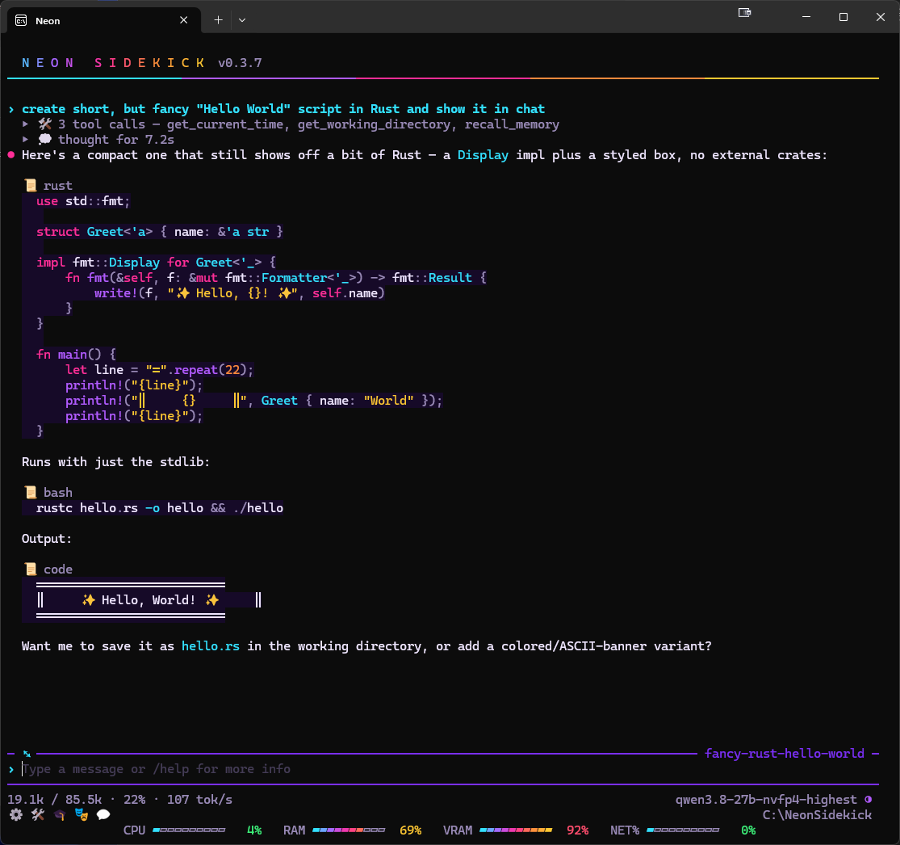
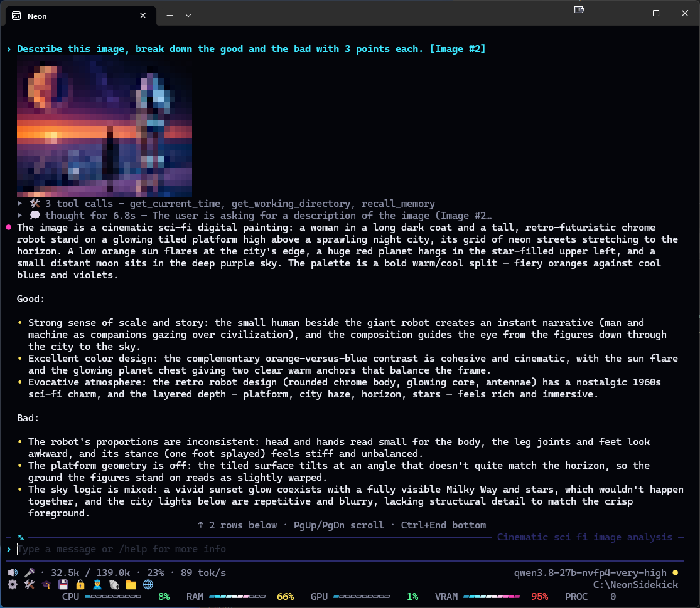
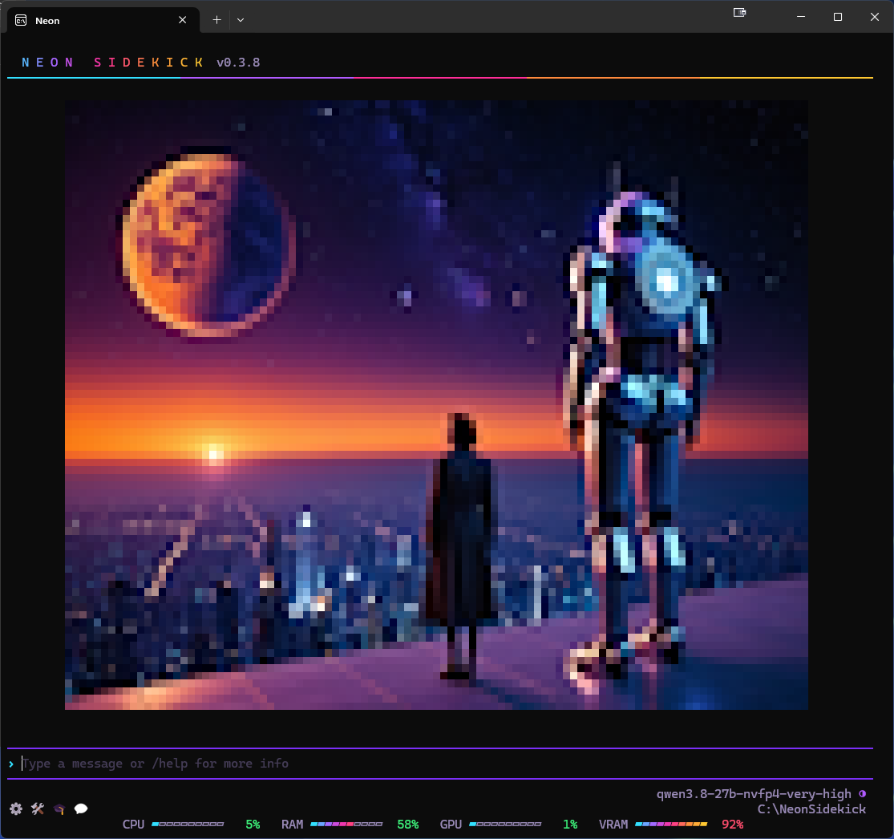
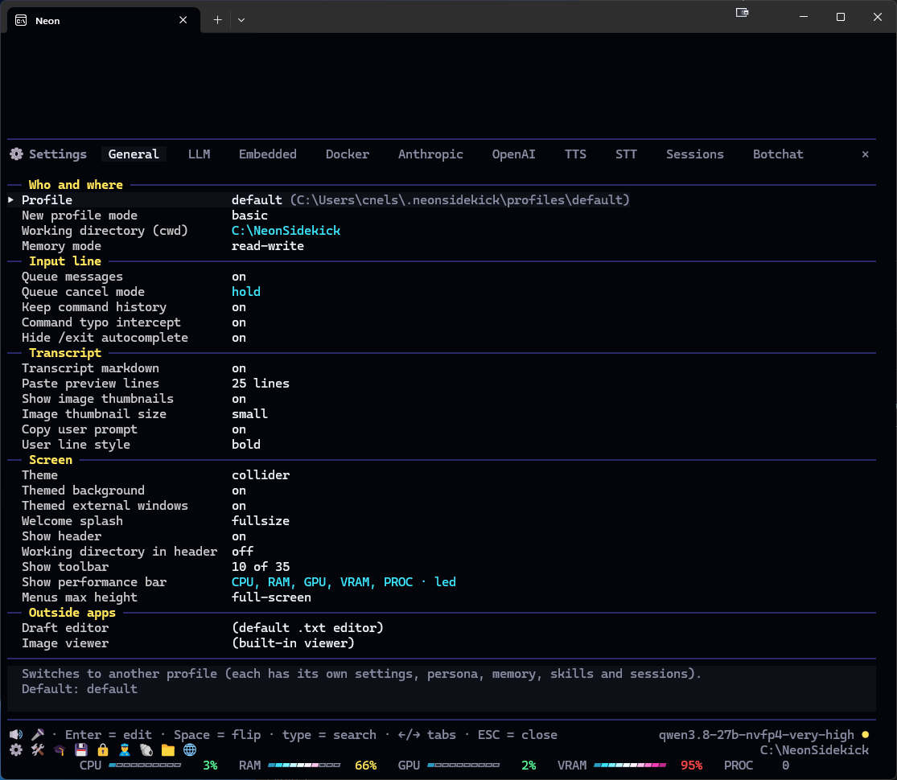

# Neon Sidekick


Neon Sidekick brings privacy-first, local LLM inference to your terminal. Powered by .NET 10 and inspired by tools like Claude Code, Hermes Agent, and Cline, this lightweight agentic TUI harness pairs many of my favorite features from those tools with my own toolsets for a 100% locally executed workflow.

**Current Status:** A stable, Windows-first foundation for agentic tool development.

**Roadmap:** Expanding core coding capabilities and delivering official macOS/Linux support.

## Contents

- [Features](#features)
- [Settings & menus](#settings--menus)
- [Slash commands](#slash-commands)
- [Tools](#tools-2)
- [Environment variables](#environment-variables)
- [Screenshots](#screenshots)
- [Components & Libraries](#components--libraries)
- [Why "Neon"](#why-neon)

## Features
[↑ Back to top](#neon-sidekick)

### Core Architecture & UI
* Built on **.NET 10 NativeAOT** for lightweight, high-performance execution.
* **Rich Terminal UI (TUI):** Powered by Spectre.Console, featuring robust support for menus, mouse input, Markdown, and images.
* **Vision & Media Input:** Full vision model support with seamless drag-and-drop and clipboard pasting for images directly into the terminal.
* **Quality of Life:** Intuitive auto-complete for commands, files, folders, skills, and tools.

### AI Connectivity & Context Management
* **Local AI Auto-Discovery:** Automatically detects and connects to most OpenAI-compatible servers on your local network (LM Studio, vLLM, SGLang, Ollama, Unsloth, etc.), while allowing full manual configuration for custom endpoints.
* **Claude API (optional):** Anthropic's Claude models as one more `/server` choice, with your own API key (stored encrypted), thinking levels, prompt caching and the cost shown in `/usage`. Off until you turn it on in the *Claude (API)* tab of `/settings`.
* **Smart Context Handling:** Configurable automatic context compaction to optimize token usage and prevent window overflow.
* **Prompt Transparency:** Visually inspect exactly what is being fed into the system prompt and see detailed compaction summaries—no black boxes.
* **Persistent Memory:** A UI-editable memory system that automatically injects essential, recurring details directly into context.
* **Message Queue:** Built-in queue for stacking and executing sequential messages.
* **Plan Mode:** `/plan <requirement>` has the model research with read-only tools, ask what it needs and present a plan, saved as `.neon/plans/<name>.md` in the working directory; nothing is changed until you approve it.

### Profiles, Sessions & Skills
* **Multi-Profile Support:** Switch between distinct configurations, each featuring its own working directory, independent settings and isolated session logging. A profile named with a leading `_` (`_test`) is temporary: the next launch opens `default` instead. `--profile <name>` (or `NEONSIDEKICK_PROFILE`) opens a named profile for one launch — temporary ones included — without changing which profile the next launch opens; an unknown name exits with code 2. `--headless` with neither opens `default`.
* **Advanced Session Management:** Easily manage, resume, search and reflect on past sessions.
* **Hierarchical Skills System:** Define and manage agent skills at the global, profile, project, or machine (`.agents\skills`) level.
* **Self-Learning:** An automatic self-reflection system that dynamically updates and creates new skills based on interactions and tool outcomes.

### Built-In Tooling & Voice
* **Essential Tools:** Sandboxed file I/O, shell integration (powershell/cmd/bash), scripting (powershell/python/node), Git management, read-only SQL Server queries, web search (DuckDuckGo/SearXNG), web browsing (httpClient/Chromium), graphical clarification prompts, and clock/timers.
* **MCP Server Support:** Seamless integration with Model Context Protocol (MCP) servers to expand tool capabilities and connect to external data sources.
* **Native Voice Stack:** Features in-process Whisper STT, push-to-talk, and Vosk wake-word integration.
* **Text-to-Speech:** Includes in-process Kokoro TTS, with support for an external HTTP Kokoro endpoint.

## Settings & menus
[↑ Back to top](#neon-sidekick)

**Navigation**
* **Keyboard:** ←/→ (switch tabs), ↑/↓ (move), Enter (edit/toggle), ESC (close).
* **Mouse:** Single-click moves the cursor; double-click selects rows/tabs. The top-right × acts as ESC. Double-clicking anywhere outside an open pane closes it. Double-clicking a picture in the transcript — a sent one, one a tool fetched or generated, `/view --chat`, `/imagine`, the splash — opens it in the built-in picture viewer (Windows) on the picture's folder, held on that picture: ← / → browse its neighbours, End follows the newest. The *Image viewer* setting can send it elsewhere — `system` for the app Windows registers (Paint), or a command. A pasted picture or the built-in splash has no file of its own, so it is written to `%TEMP%\NeonSidekick\pictures` first. A successful open prints nothing in the transcript; only a failure is reported.

**Input line**
* The input row is a full editor at all times, including while a reply streams, under a spinner, and throughout `/botchat`: ←/→, Home/End, Delete, Shift+arrows and Ctrl+A to select, Ctrl+C to copy a selection, Ctrl+X to cut it, right-click or Alt+V to paste, a click to place the cursor, ↑/↓ for the history, and the `/`, `@`, `#`, `$`, `%` and `^` lists.
* Enter while a reply runs queues the message (or runs a command that works mid-reply); a line typed there is never lost. What you leave on the row stays there, cursor and all, once the reply ends.
* Commands while a reply runs: the panes (`/help`, `/settings`, `/tools`, `/mcp`, `/sys`, `/usage`, `/about`, `/memory`, `/queue`, `/sessions`, `/skills`, `/reasoning`, `/cmdlist`, `/police`, `/emptytrash`, `/cmdclear`, `/tree`, `/vault`, `/cmdcopy`, `/persona`, `/operata`, `/vocalia`) open over it; `/tts`, `/stt`, `/wake`, `/interrupt`, `/reasoning <level>`, `/queue clear`, `/copy`, `/remember`, `/explore`, `/log`, `/timer`, `/expand`, `/collapse`, `/window`, `/cwd`, `/comfy view` and `/view <path>` run at once; `/clear`, `/new`, `/splash` and `/exit` stop it first. Every other command waits and runs when the reply ends — queued behind any message typed before it, so it follows *Queue cancel mode* too.
* ESC while a reply runs stops the speech first, then closes an open list, then cancels the reply. It never clears your draft; ESC at the idle line does.

**Double-Click Shortcuts**
* **Toolbar:** Glyph toggles its pane (or switches to another) | Working directory opens `/cwd browse` | Blank space opens `/settings`.
* **Hint Row:** Model name → `/server` (server, then model, then reasoning) | Reasoning glyph → `/reasoning` | Tokens/spinner → `/usage` | Queued count → `/queue` | Blank space → `/settings`.

**Available Panes**
* `/settings`: App, sessions, LLM, voice stack, and `/botchat` pictures
* `/skills`: Agent skills and self-reflection
* `/tools`: Callable model tools, and Claude Code (`/claude` and the advisor)
* `/mcp`: External MCP servers
* `/sys`: Read-only view of the outgoing model payload
* `/usage`: Show LLM usage statistics (tok/s, ttft, etc.)

<details>
<summary><b>⚙️ App Settings (`/settings`)</b></summary>

#### General

| Setting | What it does | Default |
|---|---|---|
| Profile | Switches to another profile (each has its own settings, persona, memory, skills and sessions). | `default` |
| New profile mode | What `/profile add` copies from the current profile: `basic` copies the settings and memories; `advanced` also copies the persona, operating-rules and voice-directive files. | `basic` |
| Working directory (cwd) | The folder the file and git tools work under; empty means the profile's own `files\` folder. Editing the row opens the folder picker `/cwd browse` uses; `/cwd <path>` still takes a typed path. | profile's `files\` |
| Queue messages | A message sent while a reply is streaming is queued (shown in the count and `/queue`) and sent when the reply ends. Off, it is still sent when the reply ends, just not listed as queued. | on |
| Queue cancel mode | What a cancelled reply does with the queue: `hold` keeps it until your next message, `drain` sends the next queued message at once, `empty` drops them all. | `empty` |
| Memory | Offers the model `save_memory` / `recall_memory` and opens every conversation with what it remembers. The toolbar shows 💾 while it is on, whose double-click is `/memory`. | on |
| Copy user prompt | `/copy` includes your prompt above the reply; off copies the reply alone. | on |
| Show image thumbnails | Draws a small colour block of each picture you send under your line. | on |
| Image thumbnail size | The block's size: `tiny` (32×8), `small` (48×12), `medium` (64×16), `large` (80×20) or `xlarge` (96×24) columns × rows, or `fullsize`: each picture as large as the transcript window allows (the width less 2, the rows above the pane), more than one stacked below each other. | `small` |
| Transcript markdown | Renders replies as styled Markdown (bold, lists, code fences, tables) instead of plain streamed text. A fence named for C#, JavaScript/TypeScript, Python, Bash, PowerShell, JSON, YAML, TOML/INI, SQL, C/C++, Java, Kotlin, Go, Rust, CSS, XML/HTML or diff is syntax-highlighted; any other fence stays plain. | on |
| Paste preview lines | How many lines of a long paste the transcript shows in dim under its `[Pasted text #n]` placeholder (0–200; 0 = the placeholder alone). | 25 |
| Hide /exit autocomplete | Leaves `/exit` out of the `/` completion list so a pick never closes the app by mistake; typed in full it still exits. | on |
| Command typo intercept | A line that is exactly a command's name without its slash (`clear`) asks *Did you mean /clear?* before sending it as text; so does a command typed with extra slashes (`//tools`, `///settings`), its arguments kept (`//profile work` → *Did you mean /profile work?*). A bare `//` is still `/settings`. | on |
| Keep command history | Stores the lines ↑/↓ recall in the profile's `sessions.db` (the newest 1,000), so they come back after a restart and after switching back to the profile. A line holding a collapsed paste or a picture is not stored. Off, nothing is stored and the stored lines are deleted the next time the profile loads. `/cmdclear` empties the history either way. | on |
| Welcome splash | How the splash pictures greet you under the banner at startup, until the first line is sent: `fullsize` shows one picture filling the screen (`←`/`→` walk the set; `Delete` twice in a row on an empty line moves a picture of the profile's own into that folder's `.trash` subfolder, which is never shown — move it back to restore it; the built-in pictures are unaffected), `tiled` shows them as thumbnails at *Image thumbnail size*, only as many as fit on the screen (`←`/`→` page through them in sets; a double-click opens one), `disabled` shows none. A profile's own `splash\` folder replaces the built-in pictures — the folder is made for you, so a picture can be dropped straight in. `/splash` shows the splash whatever this says (`tiled` when it is tiled, otherwise one picture). | fullsize |
| Working directory in header | Prints the working directory at the right edge of the banner's title line. | off |
| Show toolbar | Draws a toolbar under the hint row: at its left the glyphs a double-click opens — ⚙️ `/settings`, 🛠️ `/tools`, 🔌 `/mcp`, 🎓 `/skills`, 🎭 `/sys`, 💬 `/sessions`, 💾 `/memory` while *Memory* is on, then a lock that follows *Shell command policy* (🔒 under `ask`, 🔓 under `yolo`, none under `off`) `/cmdlist`, and 👮 while *Shell police outside paths* is on and the policy is not `off` `/police` — at its right the working directory, a double-click on which is `/cwd browse`, and between them blanks a double-click on which is `/settings`. | on |
| Theme | The colour theme: `synthwave` (the default), `netrunner` (green phosphor), `nostromo` (amber phosphor), `noir` (greyscale), `cyberpunk` (colorful), `vaporwave` (pastel), `mainframe` (blue phosphor), `grid` (light cycle), `replicant` (smog and sodium) or `abyssal` (bioluminescent). | `synthwave` |
| Draft editor | The command `/draft` opens its temporary file with (`code --wait`, `notepad`…); empty uses whatever Windows opens `.txt` files with. | (default .txt editor) |
| Image viewer | Where a double-clicked picture in the transcript opens. Empty uses the built-in picture viewer on the picture's folder (the registered app off Windows); `system` uses the editor Windows registers for the picture's type (Paint for png, jpg and bmp), or its viewer when there is none; anything else is a command, the file's path appended (`mspaint`, `"C:\Program Files\GIMP 3\bin\gimp-3.exe"`…). | (built-in viewer) |
| Themed image viewer | Whether the built-in picture viewer wears the theme: a dark title bar in the theme's colours (Windows 11; Windows 10 gets the dark bar) and the theme's background round the picture. Off keeps it black. A change reaches an open viewer the next time it is focused. | on |

#### Sessions

| Setting | What it does | Default |
|---|---|---|
| Session logging | Writes every completed turn to the profile's `sessions.db`, so `/sessions` can list, search and restore it. | on |
| Session retention (days) | Sessions whose last turn is older than this are purged at startup (0–3650; 0 = keep forever). | 0 |
| Session naming mode | How a session gets its title: `model-written` asks the model for a short slug after the first turn; `first-line` uses the first line you sent. | `model-written` |
| Session show name | Which titles show on the rule above the input row: `all-names`, `model-written` (a model-written or typed name only) or `none`. | `all-names` |
| Session tool | Offers the model `session_manager` to search, list and read this profile's earlier sessions (never restore or purge). | on |
| Session search max results | How many sessions a `session_manager` search or list returns (1–20). | 10 |

#### LLM

| Setting | What it does | Default |
|---|---|---|
| LLM scan mode | Where a blank URL looks for a server: `local` (the usual ports on this machine), `remote` (the same ports across the local network), `both`, or `disabled` (no scan; set the URL by hand). | `local` |
| LLM URL | The OpenAI-compatible base URL (`http://127.0.0.1:1234/v1`); empty scans per the mode above, and at startup the servers found are offered as `/server` offers them — then the model and reasoning pickers, all saved (ESC on the server takes the first listed, unsaved). `/server` fills it in. | (scan) |
| LLM model | The model id; empty takes the first the server lists. `/model` picks one. | (first listed) |
| LLM API key | The bearer token; `empty` for keyless local servers. | `empty` |
| LLM reasoning | The reasoning effort sent with every request: `none` (thinking off), `low`, `medium`, `high` or `xhigh`. `/reasoning` opens the same list. | `none` |
| LLM request timeout (s) | The most one HTTP request may take (up to 3600). | 3600 |
| LLM turn timeout (s) | The most one whole turn — every tool round trip included — may take (up to 21600). | 21600 |
| LLM context length | The model's context window in tokens, for the usage percentage; 0 takes the server's own figure. | 0 (server) |
| LLM mid-turn usage | What the token usage on the hint row shows while a reply is running. `estimate`: the context and tok/s update live as the reply streams, marked `~` (each streamed chunk counts as one token), and the server's real figures replace them when each request ends. `last-known`: the server's figures from the last completed request, which change only between requests. | `last-known` |
| LLM compact type | What `/compact` does: `summary` folds the older turns into one model-written summary; `prune` stubs their bulky tool results and keeps every turn. | `summary` |
| LLM compact keep recent | How many recent user turns a compact keeps word for word (0–24). | 2 |
| LLM compact show summary | After a compact, shows what it did under the notice: the summary's text as dim lines, or one line per pruned tool result (tool and size), then how many messages were protected at the start (the opening call pairs) and at the end (the recent turns kept). | off |
| LLM auto compact (%) | The share of the context window at which the next message compacts first (1–100; 0 = off). | 85 |
| LLM max turns | How many user turns the model sees before the oldest drop off (1–500). `auto` keeps every turn while LLM auto compact can run (a known context window, a share above 0) and falls back to 24 when it cannot. | `auto` |
| LLM offer tools | Whether the model gets any tools at all. Off makes every turn tool-free, for chat templates with no tool role; flipping it starts a new conversation. | on |
| LLM tool compact type | What happens when a single turn's tool calls approach the window: `prune` stubs this turn's older results and carries on, `stop` ends the turn with a notice, `nothing`. | `prune` |
| LLM max tool iterations | How many tool round trips one message may make before the turn stops (1–10000). | 10000 |
| LLM use fun verbs | The thinking spinner reads a random verb instead of `thinking` / `writing`. | off |
| LLM show thinking | A reasoning model's thinking streams into the transcript as a dim block — only its last five lines show, scrolling as it goes — then folds to one `▸ 💭 thought for 4.2s` line when the answer starts (only with Transcript markdown on). Click the line, press Ctrl+O or use `/expand` to see it again. The thinking is never spoken or logged, and only copied when you ask with `/copy --thinking` (shown or not). | on |

#### TTS

| Setting | What it does | Default |
|---|---|---|
| TTS output | Reads replies aloud (`/tts`). Fenced code blocks and tables are shown but never read aloud (nor by `/speak`). | off |
| TTS source | `in-process` runs Kokoro in this process over ONNX Runtime (the model downloads on first use); `http` uses a Kokoro-FastAPI server. | `in-process` |
| TTS HTTP URL | The Kokoro-FastAPI base URL, read while the source is `http`. | `http://localhost:8880/v1` |
| TTS voice preview | The voice pickers (and the preset picker) speak the highlighted voice as you move through them. | on |
| TTS voice preset | Picks a named blend and sets TTS voice, TTS voice 2, TTS voice mix and TTS speed in one go. It isn't saved on its own: the row shows the preset those four match, or `(custom)` once you change one by hand. Built in: `amanda`, `neon`, `richard`, `hunter`, `larry`, `jack`, `willow`. A `voice_presets.json` in the home folder replaces the list (same shape as `assets/voices/voice_presets.json`: `{ "name": { "TtsVoice": "af_heart", "TtsVoice2": "am_eric", "TtsVoiceMix": 80, "TtsSpeed": 1.2 } }`; entries out of range are skipped). | `neon` |
| TTS voice | The Kokoro voice. | `af_heart` |
| TTS voice 2 | A second voice blended in; `(none)` for the primary voice alone. | `am_eric` |
| TTS voice mix | The primary voice's share of the blend, 0–100 %. | 80 |
| TTS speed | The speech rate multiplier, 0.5–2.0. | 1.2 |

#### STT

| Setting | What it does | Default |
|---|---|---|
| STT input | Turns the microphone on: the push-to-talk key records a spoken message (`/stt`). | off |
| STT wake | Saying the wake phrase at the idle line starts a listen without a key (`/wake`). | off |
| STT wake phrase | One to three words; also the interrupt phrase. | `hey neon` |
| STT interrupt | Saying the wake phrase during a spoken reply cuts it short and listens (`/interrupt`). | off |
| STT interrupt echo guard | How close the assistant's own just-spoken text must be to the wake phrase to be ignored as an echo, 50–100 % (100 = the exact phrase only). | 100 |
| STT interrupt confirm | How long the phrase must persist in the recogniser's interim results before it counts, 0–2000 ms. | 200 |
| STT push-to-talk key | The key that records: `F1`–`F10`, `Insert`, `Home`, `End`, `PageUp` or `PageDown`. | `F4` |
| STT whisper model | The Whisper model that transcribes: `ggml-tiny.en.bin`, `ggml-base.en.bin` or `ggml-small.en.bin` (downloaded on first use). | `ggml-base.en.bin` |
| STT vosk model | The Vosk model the wake word and interrupt listen with: `vosk-model-small-en-us-0.15`, `vosk-model-en-us-0.22-lgraph` or `vosk-model-small-en-in-0.4`. | `vosk-model-small-en-us-0.15` |

#### Claude (API)

Anthropic's Claude API as a server. With the switch on and a key set, `/server` (and the startup picker) lists a **Claude API** row after the local servers; picking it saves `https://api.anthropic.com/v1` as the *LLM URL* and offers the account's Claude models, then the reasoning level. Every message is billed to the key's account. The local servers never see this key, and the Claude API never sees *LLM API key*.

| Setting | What it does | Default |
|---|---|---|
| Claude API | Offers the Claude API on `/server` while a key is set. Off (or keyless) with the Claude API saved as the LLM URL, the app looks for a server as if the URL were blank. | off |
| Claude API key | Your Anthropic API key (`sk-ant-…`). Saved encrypted for your Windows account (DPAPI) and shown as `(set, encrypted)`; typing replaces it, an empty entry clears it. `NEONSIDEKICK_CLAUDE_API_KEY` outranks it. | (none) |
| Claude API max tokens | The output cap of every request, thinking included, 1,024–128,000. A reply that reaches it stops short, and the log says so. | 32,000 |
| Claude API prompt caching | Marks the tools, the system prompt and the conversation for Anthropic's prompt cache, so each request reads what the last one sent at a fraction of the price. | on |

*LLM reasoning* is shaped per model: `low`…`xhigh` turn on adaptive thinking at that effort (`xhigh` is `high` on the 4.6 models; Haiku 4.5 and older take a thinking budget instead). `none` turns thinking off where the model allows it. Opus 5.5 and Fable always think, so there `none` means the lowest effort. The context window is the model's `max_input_tokens`. `/usage` adds a *Cache* row and a *Cost* row priced at the model's list price. That is an estimate, not the bill.

#### Botchat

| Setting | What it does | Default |
|---|---|---|
| Botchat LLM mode | Whose LLM the `/botchat` bots use. `single`: every bot runs on this profile's LLM server, model and reasoning. `multi`: each bot runs on its own profile's LLM URL, model, API key, timeouts and reasoning; the bot on this profile uses this profile's. A profile with a blank URL borrows this profile's server (with its own model, or this profile's when that is blank too). A bot whose server doesn't answer when the chat starts sits the chat out, with a notice. Read when a chat starts or resumes. | `single` |
| Botchat images enabled | Adds pictures to `/botchat` while the ComfyUI image tools are offered (ComfyUI tools on, a URL set, at least one workflow offered), drawn at *Image thumbnail size*. Off, the chat is talk only, with no tools (except `load_skill` with *Botchat skills enabled* on). | off |
| Botchat image mode | Who draws the pictures. `automatic`: after each reply, the model writes an image prompt from it in the workflow family's style, and the app draws it. The bots get no tool. `autonomous`: the bots are offered `generate_image` and draw when they choose. If a bot's reply talks about a picture it never drew (or its call failed), the app draws that picture. A call a bot writes out as text is run as a real call and never shown or spoken. | `automatic` |
| Botchat image workflow | The text → image workflow for the `automatic` pictures, picked from the offered workflows that take no input picture. Blank means the first one. | (the first) |
| Botchat image async | On: the next bot speaks while the picture renders (🖼️ — 🎨 for an image-to-image workflow — on the hint row's glyph strip until it is made, with a count after it, `🖼️ 2`, when several are pending), and the picture appears, labelled with whose reply it shows, when nothing is streaming. Off: the reply is written first but held back; its picture is drawn, then the reply appears (and is spoken) under it. ESC while the reply is held back cuts that bot short, as over a streaming reply; ESC under the picture's spinner skips just that picture. The image prompt is always written before the next turn. With async on and no voice (`TTS output` off), the pictures go to ComfyUI one at a time, each sent a second after the one before it was made. | on |
| Botchat non-TTS delay | Seconds the chat waits after each reply when no voice is playing (`TTS output` off), so the replies can be read before the next bot answers. A line you type meanwhile joins the chat; ESC during the pause ends the chat. 0 to 30; 0 turns the pause off. | 5 |
| Botchat skills enabled | Gives every `/botchat` bot the skills this chat sees (with *Agent skills* on): the starting profile's, the global ones and, with *Use external skills* on, the external ones. A bot's own profile's skills are never read. Each bot is offered `load_skill` only, never `skill_editor`, so bots can read skills but not change them. `load_skill` switched off in `/tools` turns this off too. | off |
| Botchat vision enabled | Shows each `/botchat` bot, on its turn, the pictures that appeared in the chat since it last spoke: the app's pictures (including the one of its own reply) and the other bots' `generate_image` pictures, not the ones it drew itself. The newest 4, with a caption saying whose each is. Only for models that read images: a text-only server fails the turn (in `multi` mode every bot's own model counts). Pictures aren't kept for `/botchat --resume` or in the saved session. | off |

</details>

<details>
<summary><b>🎓 Skills Settings (`/skills`)</b></summary>

#### Offered

The loaded skills, one row each with its scope (`profile`, `global` or `external`) and description, then any shadowed duplicates and any folders that were skipped and why. Enter on a skill opens its scope page: move it between the profile and global roots, rename it (what you type is forced to a skill name — lower case, hyphens between the words — and a name another skill already has is refused), edit it (its `SKILL.md` opens in your editor; the change shows the next time the skill loads), or delete it (after a confirmation).

#### Reflection

| Setting | What it does | Default |
|---|---|---|
| Reflection (auto-learn) | After enough tool calls, or a tool error the model recovered from, a background reflection writes or improves a skill. | on |
| Reflection reasoning | The reasoning effort of the reflection alone: `none`, `low`, `medium`, `high`, `xhigh`, or `profile` for the profile's own level. | `none` |
| Reflection window | How many of the last turns a reflection reads (1–5; the last in full, the earlier ones trimmed). | 3 |
| Reflection min tool calls | How many of the model's own tool calls, added up since the last reflection, make a task worth a skill (3–20). | 4 |
| Reflection max requests | How many model requests one reflection may spend before it gives up (1–20). | 4 |
| Reflection cooldown (minutes) | How long after a skill was written an automatic reflection waits (0–1440; 0 = off). | 5 |
| Reflection cooldown mode | `last-written-skill` makes only a turn that used the skill just written wait; `all-skills` makes every automatic reflection wait. | `last-written-skill` |
| Reflection includes sessions | The reflection opens with the earlier sessions that match the turn, and can search them. | on |
| Reflection yields to turns | A message sent while a reflection runs pauses it, so the reply gets the server; the same reflection runs again once the reply and any queued messages are done. Turn off if your server serves requests in parallel. | on |
| Reflection edit supporting files | A reflection may also change a skill's supporting files (the data, examples or scripts beside its `SKILL.md`) with `skill_editor`'s `write_file` and `edit_file`. Off, a reflection writes the `SKILL.md` alone; the main chat may always write them. | off |

#### Project

One row, **Project file**: whether `NEON.md` (or `AGENTS.md`) in the working directory is read into the prompt as project notes. The row shows which file is found and its size. Default on.

#### Options

| Setting | What it does | Default |
|---|---|---|
| Agent skills | Lists the skills in the prompt and offers `load_skill` and `skill_editor`; off also stops reading the project file. | on |
| Use external skills (.agents\skills) | Also reads `%USERPROFILE%\.agents\skills`, read-only. | off |
| Skill compact mode | `protected` keeps a loaded skill's instructions through a prune; `unprotected` prunes them like any tool result. | `protected` |
| #-mention enabled | `#` and part of a name on the input line lists the loaded skills; a pick writes `#name` as text. | on |

#### Installing skills

`/skills add` brings in skills written in the [Agent Skills](https://agentskills.io) format, the same folders other agents use.

- **What it takes:**
  - Search words (`/skills add pdf`) look the skill up on [skills.sh](https://skills.sh), the public directory. agentskills.io itself hosts only the specification.
  - `owner/repo` offers every skill in a GitHub repository.
  - `owner/repo/skill` names one skill. This is the id a search shows, so a result can be typed back.
  - A `github.com/…/tree/<branch>/<path>` or `…/blob/<branch>/<path>/SKILL.md` link narrows the search to a folder.
  - Any `https://…/*.zip` link is downloaded as it is.
- **Where it comes from:** a repository is not downloaded whole. The app asks the GitHub API for its file list at the branch's latest commit (two requests; GitHub allows 60 an hour without a token), finds every `SKILL.md` wherever it sits (`skills/`, `.claude/skills/`, `.agents/skills/`, the root), and fetches only the `SKILL.md` files, then the chosen skill's files once you say yes, from `raw.githubusercontent.com`, pinned to that commit. Large repositories work too. A repository with more than 100 skills has to be named down to one (`owner/repo/skill` or a folder link). If the API is rate-limited, unreachable or cuts the list short, the app falls back to GitHub's zip of the whole branch (up to 50 MB).
- **Network rules:** the download goes through the web tools' client, so *Web browser network mode* applies. Under `local_area_network` nothing is fetched. The *Web tools* switch is not consulted, because you typed the command, not the model.
- **Before anything is written:** the skill is previewed — its description, source and commit, other frontmatter such as `allowed-tools`, the file list, any scripts, and the start of its instructions. The install is refused when:
  - a path could escape the folder, or is not a valid Windows path;
  - two files differ only by case;
  - it has more than 200 files, over 20 MB in total, or any file over 5 MB.

  Symbolic links are left out.
- **Where it goes:** the folder lands under the profile's or the global `skills` folder, named after the skill, with a `.neon-source.json` beside its `SKILL.md` recording the repository, path, commit and date. Bundled scripts run only through `run_command` and its approval, like any other command.
- **Name collisions:** a name already in use is refused; rename or delete the existing skill on `/skills` first. The exception is a skill installed earlier from the same repository and path — adding it again replaces it where it is (an update).

</details>

<details>
<summary><b>🛠️ Tools Settings (`/tools`)</b></summary>

#### Offered

Every tool the app has, grouped (Clock, Timers, Files, Git, Shell, Obsidian, SQL, ComfyUI, Claude, Web, Memory, Skills, Sessions, Questions) with the description the model reads. Enter or Space flips a single tool on or off; a group whose switch is off is shown dim. `git_delete` — the git tool that loses branches, tags and stashes — and `zip` / `unzip` — the bulk pack and extract — start off; `git_discard` is on out of the box (a profile saved earlier keeps its own list).

#### Web

| Setting | What it does | Default |
|---|---|---|
| Web tools | Offers `web_search`, `web_fetch`, `open_url` and `download_file`. | on |
| Web browser mode | `default` fetches with the HTTP client and falls back to a headless browser when a page is blocked or empty; `httpclient` never falls back; `chromium` uses the browser for every page. | `default` |
| Web browser path | The Chromium executable for the headless leg; empty finds Edge, Chrome or Brave in their standard folders. | (auto) |
| Web browser network mode | Where a fetch may reach: `internet` (public addresses only), `local_area_network` (this machine and the LAN only) or `both`. | `internet` |
| Web search method | `duckduckgo` (built in, no setup) or `searxng` (the instance below). | `duckduckgo` |
| Web SearXNG URL | A SearXNG instance's base URL, used while the method is `searxng`. | (not set) |
| Web search max results | How many hits a search returns (1–20). | 20 |

#### Files

| Setting | What it does | Default |
|---|---|---|
| File tools | Offers the sandboxed file tools (read, write, patch, search, move, copy, zip, view_image…) under the working directory. | on |
| File safe edits | Every edit keeps the previous version in `.trash` first and `delete` moves there, with `restore` as the undo; off writes in place and `delete` removes for good. Best when working a directory without Git. | off |
| File /tree max length | How many entries `/tree` prints before it stops (1–10000). | 500 |
| File /tree show sizes | `/tree` carries each file's size. | on |
| File @-mention folder mode | Picking a folder from the `@` list: `folder-remain` keeps the list open inside it; `folder-apply` writes `@folder/` and closes. | `folder-remain` |
| File browser/tree mode | What the folder browsers (`/cwd browse`, the *Obsidian vault* row) and `/tree` list: `default` hides hidden and system entries and dot-folders (and, in `/tree`, dot-files); `show-hidden` lists them too. | `default` |
| File view image max (per call) | How many pictures one `view_image` call may load (1–100). | 10 |

#### Shell

| Setting | What it does | Default |
|---|---|---|
| Shell command policy | What stands between `run_command` and the shell: `off` (no shell tool is offered — the group's switch), `ask` (a command whose prefixes are not all allowed is put to you on the pane first: Deny, Allow once, Allow the prefixes for this session, or Allow them always; with no pane to ask on it is refused), `yolo` (everything runs, nothing is asked). The toolbar shows it as a lock — 🔒 under `ask`, 🔓 under `yolo`, none under `off` — whose double-click is `/cmdlist`. `--yolo` (this launch only) and `NEONSIDEKICK_COMMAND_POLICY` outrank it, so a scripted `--headless` run can say `yolo`. | `ask` |
| Shell allowed commands | The prefixes allowed for good — `git status`, `dotnet build`, `python` (the program, plus its subcommand for git, dotnet, npm, pip, gh, docker, cargo, go, winget and the like). Enter on one removes it; the pane's *Allow … always* adds one; `/cmdlist` (or the toolbar's lock) opens the list straight; `/cmdcopy` copies it into another profile. | none |
| Shell police outside paths | Whether a `run_command` line, an `execute_code` script or the text `process` writes to a background process may name a path outside the working directory. On: an absolute path not under it (`C:\…`, a UNC share, a rooted `/etc/hosts`), a `..` that climbs out, `~`, or a folder variable (`%USERPROFILE%`, `$env:TEMP`, `$HOME`, `Path.home()`…) is refused before anything runs or the pane asks — the model gets `Error: outside the working directory: '…'`, the transcript line wears 👮 — and the tool descriptions and the operating rules say the shell stays under the working directory. It reads the text, not what runs: a script that computes a path is not seen, and a cmd switch (`dir /s`) or a URL is not a path. Off: any path goes, and nothing tells the model it may leave the working directory, so it does not try unless asked. The toolbar shows 👮 while it is on, unless *Shell command policy* is `off` (no shell tool to police); a double-click on it, or `/police`, opens this row's on/off page straight. `--no-police` (off, this launch only) and `NEONSIDEKICK_SHELL_POLICE` (`on`/`off`) outrank it; `--yolo` never turns it off. | on |
| Shell prefer native tools | Whether the shell steps aside for the app's own tools. On: the operating rules tell the model to use `run_command` only for what no other tool does, naming the tools offered that turn and the shell words each replaces (`cat`/`type`/`Get-Content`/`dir`/`ls`/`grep` → `read_file`/`search_files`, `git status`/`log`/`diff`/`add`/`commit` → the git tools, `curl`/`Invoke-WebRequest` → `web_fetch`, `sqlcmd` → `sql_query`); and a `run_command` line of one command that such a tool covers is not run — the model gets `Not run: 'cat' has a tool of its own — call read_file instead…` before the approval pane is asked. Once a turn: the same line again goes on to the pane as usual, so a real need (an option the tool lacks) still reaches you. Pipes and compound lines (`cat x \| sort`, `a && b`), verbs with no tool (`git push`), tools switched off, and (with the police off) a line naming a path outside the working directory are never sent back. Off: the shell runs what it is given. `NEONSIDEKICK_SHELL_NATIVE` (`on`/`off`) outranks it. | on |
| Shell default | The shell a `run_command` without `shell` runs in: `powershell` (pwsh when installed, else Windows PowerShell 5.1), `cmd`, or `bash` (Git Bash, when found). | `powershell` |
| Shell timeout (s) | How long a foreground command without `timeout` may run before it is killed (1–3600). | 180 |
| Shell foreground cap (s) | The most a foreground command may wait, whatever its `timeout` says (10–3600). | 600 |
| Shell output max chars | The most output one result carries back (2000–500000); over it the head and tail are kept and the whole text goes to `.shell\<id>.log` under the working directory, where `read_file` reaches it. | 30000 |
| Shell code languages | The languages `execute_code` may run — `powershell`, `python`, `node`; one or more, and a language is offered only while its interpreter is found. Enter or Space flips one; the last one on stays. | all three |
| Shell code timeout (s) | How long an `execute_code` script without `timeout` may run before it is killed (1–3600). | 300 |
| Shell tool bridge | Whether an `execute_code` script may call the app's other tools through its `neon_tools` module (a loopback socket with a per-run token). Off: no module is written, the script's environment carries no bridge, and neither the tool's description nor the operating rules mention calling tools — the script does everything itself. | off |
| Shell tool bridge max calls | How many tool calls one script may make through its bridge (1–500), while `Shell tool bridge` is on. | 50 |

#### Ask

| Setting | What it does | Default |
|---|---|---|
| Ask user | Offers `ask_user`, which puts multiple-choice questions on the pane. | on |
| Ask max questions | How many questions one call may put (1–10). | 10 |
| Ask max choices per question | How many options one question may offer (2–15). | 10 |

#### Git (native)

| Setting | What it does | Default |
|---|---|---|
| Git native tools | Offers the git tools (status, log, show, diff, blame, branch, stage, commit, stash, discard, delete) over the repository in the working directory — in-process, no `git.exe`. Off, the model reaches git through the shell only, and `/gituser` does nothing. | off |
| Git native diff max lines | Where a `git_diff` patch is cut (20–5000). | 500 |
| Git native log max commits | How many commits `git_log` returns unless the call says otherwise (1–200). | 20 |
| Git native email | The `user.email` that `/gituser` writes into the working directory's repository config while *Git native tools* is on. Never read by the git tools. | (not set) |
| Git native name | The `user.name` that `/gituser` writes beside it. | (not set) |

#### Obsidian

| Setting | What it does | Default |
|---|---|---|
| Obsidian tools | Offers the vault tools (search, list, read, links, daily, write, properties, move) over the vault below. On, but nothing is offered until a vault is set. | on |
| Obsidian vault | The Obsidian vault's folder — the one holding `.obsidian` (a folder Obsidian has opened); editing the row opens the `/cwd browse` folder picker on the vault set (on the working directory while none is). Separate from the working directory: the vault is where the notes live. `NEONSIDEKICK_OBSIDIAN_VAULT` outranks it. | (not set) |
| Obsidian allow delete (.trash) | Offers `vault_delete`, which moves a note or attachment into the vault's `.trash` (never deleted for good). A profile saved with it off keeps it off. | on |

#### SQL

| Setting | What it does | Default |
|---|---|---|
| SQL tools | Offers the SQL tools (connections, databases, tables, columns, describe, relationships, indexes, query) over the connections in `sql.json`. On, but nothing is offered until a connection is defined. | on |
| SQL connections offered | Which connections of `sql.json` this profile offers the model: a checklist of every connection in the two files. Until you first use it every connection is offered, new ones too; once narrowed, only the ticked ones are, and a connection added to `sql.json` later stays hidden until you tick it. A hidden connection is out of every SQL tool, the rules, the `%`-mention and the default; `sql_connections` tells the model how many are hidden, never which. | all (not narrowed) |
| SQL default connection | The connection a SQL tool uses when the call names none: a pick of the offered connections, or the first. A default, not a limit: a call that names another offered connection uses that one, and `database` still opens other databases on the same server under that login. | (the first connection) |
| SQL set password | Enter picks a connection that takes a password (`sql` or `runas`) and asks for it masked, then saves it to that connection's store: encrypted in its `sql.json`, or Windows Credential Manager. | — |
| SQL add connection | Enter walks a new connection through every choice, one page each: the scope of `sql.json` (profile or global), the name, the server, the database, the sign-in (`sql`, `windows` or `runas`), the account, where its password is kept and the password (masked), the encryption, trusting a self-signed certificate, the connect timeout and the description. The summary can **test** the unsaved draft (`SELECT @@VERSION`, nothing written) and saves it into the file, comments kept, the password encrypted or in Credential Manager; on a profile that narrowed *SQL connections offered* it can offer the new one too. ESC steps back a page; Enter on a summary row changes that choice. Adds only: edit an existing entry in the file. | — |
| SQL %-mention enabled | `%` and part of a name on the input line lists the SQL connections of `sql.json` (with their server, database and description); a pick writes `%name` as text. Lists nothing while *SQL tools* is off. | on |
| SQL max rows | How many rows `sql_query` returns unless the call says otherwise (1–1000); past it the header says more exist and the server stops. | 100 |
| SQL query timeout (s) | How long one SQL tool's batch may run on the server before it is stopped (1–600). | 30 |
| SQL connections (profile) | Enter opens the profile's `sql.json` in the editor (made first with a commented example of each kind: a SQL login, Windows sign-in as you, and runas with its password in Credential Manager or in the file); the value counts its connections. | (none) |
| SQL connections (global) | The same for the home's `sql.json`, which every profile reads; the profile's wins a name. | (none) |

#### ComfyUI

| Setting | What it does | Default |
|---|---|---|
| ComfyUI tools | Offers the image tools (`generate_image`, `set_splash_image`) over your ComfyUI server. On, but nothing is offered until *ComfyUI URL* is set and a workflow is in a `comfy` folder. | on |
| ComfyUI URL | The ComfyUI server, often another machine on your LAN (`http://gpu-box:8188`). Your own server like the LLM's, so the web tools' network mode never blocks it. `NEONSIDEKICK_COMFY_URL` outranks it. | (not set) |
| ComfyUI workflows offered | Which installed workflows the model is offered: a checklist of every workflow in the two `comfy` folders. Until you first use it every workflow is offered, new ones too; once narrowed, only the ticked ones are, and a workflow added later stays hidden until you tick it. Narrow it to one and every plain request, and a plain `/imagine`, goes there. `/imagine <name>` can still use a hidden one. | all (not narrowed) |
| ComfyUI add workflow | Enter walks a new workflow through every choice, one page each. **Build** makes a standard one from what your server has: text → image or image → image, the checkpoint (from the server's list), the family, the folder (this profile's or every profile's), the name, the CLIP skip, the sampler and scheduler (from the server's lists), the default size, steps, CFG, denoise and negative, and a description. **Import** takes a workflow you exported from ComfyUI (*Workflow → Export (API)*): the wizard finds the prompt, negative, seed, steps, CFG, size and input-image nodes, puts the placeholders in, and keeps the export's values as the defaults. It reads both kinds of sampler graph: a plain `KSampler`, and the custom-sampler graph FLUX.2 uses (`SamplerCustomAdvanced` with its `RandomNoise`, scheduler and guider — the `FluxGuidance` is what CFG sets there). A value fed by a primitive node gets its placeholder there; one set by another node (a switch, a resolution picker) is left as the author built it, and the wizard says so. FLUX.2, Krea 2, Z-Image, Qwen Image, Ernie Image, Boogu, LongCat Image, HiDream I1 and Ideogram 4 load as separate model files, which **Build** cannot wire: export ComfyUI's own template for them and **Import** it. (Copybara has no family yet.) The summary can **test** the draft (one small run, 512 px and 8 steps at most, nothing saved here) and saves it as `<name>.json` + `<name>.md`; on a profile that narrowed *ComfyUI workflows offered* it can offer the new one too. ESC steps back a page. | — |
| ComfyUI ^-mention enabled | `^` and part of a name on the input line lists the workflows the model is offered (with their family, shape and size); a pick writes `^name` as text, and `generate_image` reads it as the workflow to use. Lists nothing while the image tools are not offered (*ComfyUI tools* off, no *ComfyUI URL*, or no workflow offered). | on |
| ComfyUI timeout (s) | How long one generation may take, queue wait included, before the tool stops waiting (10–3600); the job may still finish in ComfyUI. | 300 |
| ComfyUI max pictures per call | The most pictures one `generate_image` call or `/imagine --count` makes (1–16). Each is a full job the server runs in turn while the reply waits, and every one the model makes goes to it in the next request, where a local vision server has its own limit, hence a cap. | 5 |
| ComfyUI reinforce negatives | When the model writes a prompt itself, it also names a handful of opposite tags where the image model tends to drift (a solo figure → `multiple girls`, night → `daylight`, a photo → `illustration, anime`), appended to the workflow's own negative — which stays. Never for a prompt you gave it to send as is, a negative set for the call, `/imagine`, a family that runs without a negative (Flux, FLUX.2, Klein, Krea 2, Z-Image, Ernie Turbo, Boogu, Ideogram 4), or a workflow whose `.md` says `reinforce: false`. The result's `negative:` line shows what was sent. | on |
| ComfyUI show prompts | Show what was sent to ComfyUI under each picture's line — the `prompt:` (the one the model wrote, or yours) and the `negative:` (the workflow's or the family's, plus any reinforcing tags) — in full, then a `params:` line (size, steps, cfg, denoise, seed, sampler, scheduler, as the workflow's graph carries them), for the model's pictures and `/imagine` alike. Off, the picture's line alone; the model sees the same result either way. | on |
| ComfyUI picture strip | Keep the session's ComfyUI pictures (the model's and `/imagine`'s) as small thumbnails in a strip over the input line, the newest at the left. With the input line empty, ← / → highlight one, Enter opens it in the image viewer; a double-click opens any. The strip's rule carries a **🖼  viewer** button (Windows): one click opens a picture window on the ComfyUI output folder, as `/comfy view` does. `/clear`, `/new` and a session switch empty it; hidden while a menu is open or the window is too short. | on |
| ComfyUI output folder | The folder under the working directory the pictures are saved in (`comfy_images\pony-txt2img-1234.png`, a number added when the name is taken); empty = the working directory itself. A profile saved with the earlier default, `images`, keeps it. | `comfy_images` |

#### Claude (CLI)

The Claude Code CLI, for `/claude` (you send it a message) and for `claude_advisor` (the model asks it for advice on its own).

| Setting | What it does | Default |
|---|---|---|
| Claude executable | The Claude Code CLI `/claude` and the advisor run. Blank looks for `claude.exe` on the PATH, then npm's `claude.cmd`, then `%USERPROFILE%\.local\bin\claude.exe` (where the native installer puts it). A path you set must exist; it is never swapped for another. `NEONSIDEKICK_CLAUDE_EXE` outranks it. | (looked up) |
| Claude slash command permissions | What Claude may do on its own during a `/claude` run. `read-only`: read, search and fetch (`Read`, `Grep`, `Glob`, `WebSearch`, `WebFetch`), nothing else. `edit`: its usual tools, with file edits accepted without asking; commands are denied. `full`: everything, commands included, without asking (`bypassPermissions`). Nothing is ever asked about: whatever the level does not allow is denied on the spot, and the reply says which tools were denied. Claude works in the working directory, but it runs outside the app's own sandbox, the shell policy and the approval pane. The advisor is always `read-only`, whatever this says. `NEONSIDEKICK_CLAUDE_PERMISSIONS` outranks it. | `read-only` |
| Claude slash command model | The `--model` for `/claude`, picked from a list: Claude Code's own default, the aliases `fable`, `opus`, `sonnet` and `haiku` (the latest model of each), or *Other…* to type a full model name. | (Claude Code's default) |
| Claude slash command effort | The `--effort` for `/claude`, picked from Claude Code's own default, `low`, `medium`, `high`, `xhigh` or `max`. | (Claude Code's default) |
| Claude advisor tool | Offers the model `claude_advisor`: when it is stuck or unsure of the best course, it can ask Claude Code for advice on its own, read-only. Each call costs money on your Claude account, so it is off until you turn it on. `NEONSIDEKICK_CLAUDE_ADVISOR` outranks it. | off |
| Claude advisor tool context | What an advisor call sends Claude. `brief`: the model's question and the context it writes. `recent`: those and the conversation's last 10 messages (tool results cut to 500 characters). Claude can read the working directory itself either way. | `brief` |
| Claude advisor tool calls per turn | The most advisor calls one reply may make (1–10); a call past it is refused and the model carries on alone. | 2 |
| Claude advisor tool model | The `--model` for the advisor, picked from the same list; its first row follows *Claude slash command model*. | (as Claude slash command model) |
| Claude advisor tool effort | The `--effort` for the advisor, picked from the same list; its first row follows *Claude slash command effort*. | (as Claude slash command effort) |
| Claude advisor tool confirm | Each advisor call waits for your yes on the pane first (the cursor starts on No; ESC is a no). A no tells the model to carry on without it. Headless has no one to ask, so a call there is refused. | off |

#### Options

| Setting | What it does | Default |
|---|---|---|
| $-mention enabled | `$` and part of a name on the input line lists the tools the next turn offers; a pick writes `$name` as text. | on |
| Tool collapse count | A run of tool calls longer than this folds under one summary line (`▸ 🛠️ 7 tool calls — read_file ×3, …`), showing only its last lines while it runs and the summary alone once the reply moves on. Click the summary, press Ctrl+O or use `/expand` to see every line (0–100; 0 = never fold). | 2 |
| Code collapse count | A code block in a reply longer than this folds to its label line (`▸ 📜 csharp · 57 lines`) as soon as its closing fence arrives; while it streams, only its label and its last this-many lines show (0 streams it at full height). Top-level blocks only, and only with Transcript markdown on. Click the label, press Ctrl+O or use `/expand` to see it again (0–100; 0 = never fold). | 20 |

</details>

<details>
<summary><b>🔌 MCP Servers & System (`/mcp` & `/sys`)</b></summary>

### MCP servers (`/mcp`)

#### Servers

One row per server named in `mcp.json` (the profile's, then the home's; the profile wins a name) with its state — `connected · N tools`, `connecting`, `failed: …`, `off` — and its transport. Enter or Space switches a server on or off and connects or disconnects it at once; Enter on a failed server retries. Below them: `edit profile mcp.json`, `edit global mcp.json` and `reload`, then any entries that were skipped and why.

#### Tools

Every connected server's tools as `<server>__<tool>` with the description the server gives; Enter or Space flips one on or off.

#### Options

| Setting | What it does | Default |
|---|---|---|
| MCP servers | The master switch: on, every enabled server is started at launch and after a profile switch and its tools are offered; off, nothing is started. | off |
| MCP connect timeout (s) | How long one server gets to answer the handshake and list its tools before it is marked failed (5–300). | 30 |

### System prompt (`/sys`)

Read-only: exactly what the next reply will be sent, nothing paraphrased.

#### Prompt

The system prompt section by section, each with its status — **Persona** (default or `persona.md`), **Operating rules** (default or `operata.md`; the reply-format and tool sentences live here), **Project notes** (`NEON.md` / `AGENTS.md`), **Memory**, **Skills** (the catalog), and **Voice directive** (default or `vocalia.md`, only on a spoken turn, always last).

#### Tools

Every tool the reply may call, grouped — Clock, Timers, Files, Git, Web, Memory, Skills, Sessions, one group per connected MCP server, Questions — each with the description the model reads. Only what the reply is actually sent: a tool switched off, or a whole group whose setting is off, is left out (`/tools` lists everything, with the reason).

</details>

## Slash commands
[↑ Back to top](#neon-sidekick)

Type `/` and the list opens with every command and its summary; after the command and a space, the argument list follows for any argument that can be listed. `//` is the one alias (for `/settings`); it is never listed.

<details>
<summary><b>Click to expand all Slash Commands</b></summary>

| Command | What it does |
|---|---|
| `/about` | Show the app's version, runtime, folders, components and licence. |
| `/claude <message>` | Send the message to Claude Code (the `claude` CLI, run headless in the working directory) and stream its reply into the transcript under Claude's name, with each tool it uses on a dim line and a footer with the cost and tokens; with speech on, the reply is spoken. The question and the reply are added to the conversation, tagged `[to Claude]` and `[Claude]`, so the local model can build on them; Claude does not see the local conversation. Each session has one Claude conversation: the next `/claude` resumes it (after a restart too, once the session is restored), and `/claude new` starts another; `/clear`, `/new` and a profile switch start another too. What Claude may do is *Claude slash command permissions* (the Claude (CLI) tab of `/tools`): anything past it is denied, never asked. ESC or Ctrl+C stops Claude (the reply so far is kept). Works with no LLM server; refused while a reply runs. Your own Claude Code setup applies: its sign-in, `CLAUDE.md`, skills, MCP servers and hooks. `/usage` shows what the runs cost. |
| `/clear` | Start a new conversation and clear the screen. |
| `/cmdcopy <profile> [--history] [overwrite]` | Copy this profile's allowed shell commands (the *Shell allowed commands* prefixes) into another: added to its list, or in place of it. With `--history`, copy its stored command history into the other profile's `sessions.db` instead (refused while that profile has *Keep command history* off). |
| `/cmdclear` | Clear this profile's command history, the stored lines and the ones ↑/↓ recalls now, after a confirmation. |
| `/cmdlist` | The *Shell allowed commands* list on a pane, straight (the toolbar's lock opens it too): Enter removes a prefix, ESC closes. |
| `/police` | The *Shell police outside paths* on/off page on a pane, straight (the toolbar's 👮 opens it too): pick on or off, ESC closes. |
| `/compact [focus]` | Shrink the current context; a focus steers the summary. |
| `/copy [n \| all] [--thinking]` | Copy the last reply to the clipboard as Markdown, or the last *n* replies, or the whole transcript. `--thinking` includes the model's thinking, each block quoted under `💭 **Thinking**` where it happened. |
| `/cwd [path \| ~ \| browse]` | Show or change the working directory; `browse` opens a folder picker on the pane: the profile's own `files\` folder as `⌂ profile` and its `splash\` folder as `▣ splash` above the drives, opened on the directory in force (Enter chooses — the profile row saves the default, like `~` — Space/→/← open and close, `-` collapses all; a click on a folder's glyph or a double-click on its name opens or closes it; only Enter chooses). |
| `/draft` | Write the next message in your editor; the file is sent when it is saved and closed. |
| `/echo <text>` | Print a line as a reply and read it aloud when speech is on. |
| `/emptytrash` | Empty the working directory's `.trash` for good (asks first). |
| `/exit` | Exit the app. |
| `/explore [path]` | Open the working directory in your file browser. |
| `/gituser [force]` | Write the *Git native email* and *Git native name* settings into the working directory's repository config as `user.email` / `user.name`; a `[user]` section already there is kept unless `force`. Does nothing while *Git native tools* is off. |
| `/help` | Show the commands and the keys: the everyday commands on the Commands (basic) tab, every other one on Commands (advanced), then Keys. |
| `/interrupt [on\|off]` | Toggle the wake-word interrupt during a spoken reply. |
| `/learn [note \| sessions [N \| text]]` | Write or improve a skill in the background from the last turn, or from the stored sessions. |
| `/log` | Only when the app was started with `--log <path>`: open that diagnostic log file in your editor. Without the flag, `/log` is an unknown command and neither `/help` nor the `/` list shows it. |
| `/loop <count> [delay] <message>`, `/loop infinite [delay] <message>` | Send the message that many times, or until ESC or Ctrl+C stops it, each reply waited for; a cancelled, withdrawn or failed turn ends the loop. An optional delay after the count (`30s`, `5m`, `1h30m`, one word, up to 24 hours) waits that long after each reply before the next pass; ESC or Ctrl+C during the wait stops the loop too: `/loop infinite 1m check the build`. The message may instead be `/imagine …` or `/speak …`, which the loop runs itself, no model in between: `/loop infinite 5s /imagine score_9, 1girl`. A failed generation, a bad path or ESC ends it; `/speak` waits for each reading to be heard before the next; only the last pass's pictures go with your next message. Other commands cannot be looped. |
| `/plan <requirement>` | Plan before anything is done. Plan mode offers the model only the read-only tools (reading and searching files, git status/log/diff, the web, SQL, the vault, recall, skills, sessions, `ask_user`) and `present_plan`; every tool that writes, runs or starts something, and every MCP tool, is left out until the plan is approved. The model asks what it needs (your later messages add detail), then presents the plan: it is saved as `.neon/plans/<kebab-name>.md` under the working directory (a new name never overwrites an older plan; each revision overwrites its own file) and printed, and a pane asks **Approve & run** (`a`), **Approve, clear context & run** (`f`), **Keep refining…** (`r`, with what should change) or **Cancel plan** (`c`); the cursor starts on Keep refining and ESC keeps refining too. Approving marks the file `status: approved` and sends a turn with every tool to carry it out, ticking the plan's checkboxes; the fresh-context choice starts a new conversation with the plan's text in the message. While planning, 📝 is on the status strip, `/plan` or `/plan show` says where the plan stands, `/plan approve [--fresh]` approves the presented plan by typing (you may edit the file first), `/plan cancel` leaves (the file is kept, marked `cancelled`), and any other `/plan <text>` is more detail. If a planning reply looks like a plan but the model never called `present_plan`, a notice says so and `/plan save [name]` keeps that reply as the plan and brings up the same approval pane. After approval the plan is tracked: when every checkbox is ticked the file is marked `done`, and while some are left it is `incomplete` with a `progress: 3/7` line (said again when the count moves or the reply is stopped). `/plan open <name>` (in or out of plan mode; the names complete from `.neon/plans/`) picks a plan up again — plan mode on over that file, back to `draft`, and a turn asking the model to read it and ask what should change; `/plan approve` then carries out only the steps not ticked yet. `/plan open` alone lists the plans with their status and progress. `/new`, `/clear` and a profile switch leave plan mode; a restored session is still planning. Needs *LLM offer tools* on; refused while a reply runs. |
| `/botchat [profile ...] [topic]` | Let the profiles talk to each other until you stop them: the profiles named, or every profile when none is, with this one always joining and speaking first. A leading word that isn't a profile starts the topic: `/botchat ada max the best pizza`; after `--` the rest is always the topic, even when it starts with a profile's name: `/botchat ada -- max speed of light`. Without a topic the bots pick their own. Each reply is in the speaker's own persona (`persona.md`) and, with speech on, its own voice. Turns run one after another, on this profile's LLM server and model; with `Botchat LLM mode` set to `multi`, each bot runs on its own profile's server, model and reasoning instead. A bot named in the last line (yours, or the last reply) speaks next, one of them if several are named; otherwise the next speaker is random but never the one who just spoke. No tools, except pictures: with `Botchat images enabled` on (the Botchat tab of `/settings`) and ComfyUI offered, the app draws a picture of each reply or the bots are offered `generate_image`, as `Botchat image mode` says. A line you type meanwhile joins the chat before the next reply (the input row stays a full editor throughout). ESC works as a ladder: the first press stops the speaking bot's voice (speech on), the next cuts the bot now replying short (its words so far stay in the chat) and the next bot answers, and one more, before that next bot has shown or said anything, ends the chat; a further ESC at the idle line clears your draft. A command that cancels (`/exit`, `/clear`, `/new`) ends the chat and then runs. `/botchat --resume [line]` carries on the last chat of this run where it stopped (same cast, topic and lines, and the same session row); a line after it joins the chat as yours. Each bot is told the others' pronouns from their profile's first TTS voice: `am_`, `bm_`… male, anything else female. With `Session logging` on the chat is saved as a session of its own; the current conversation is left as it was. |
| `/expand` | Show every line of the folded tool runs, code blocks and thinking in the transcript, and of the ones to come (Ctrl+O flips between this and `/collapse`). |
| `/collapse` | Fold the tool runs, code blocks and thinking in the transcript again. |
| `/mcp` | Connect external MCP servers and switch their tools on or off. |
| `/memory [forget \| edit \| copy <profile> [overwrite]]` | List and prune the memory items on a pane (the toolbar's 💾 opens it too): Enter removes one, ESC closes. `/memory forget` forgets every one (asks first). `/memory edit` opens `memory.json` in your editor (creating it if needed); your changes are read back the next time memory is used, and an edit that is not valid JSON is ignored with a warning (the memories stay as they were). `/memory copy <profile>` copies them into another profile, appended after what it already holds and skipping the duplicates; `overwrite` replaces its memory instead. Either copy asks first. |
| `/model [id]` | Pick a model from the server's list, or set one. |
| `/new` | Start a new conversation without clearing the screen. |
| `/operata [reset \| copy <profile> [force]]` | Edit `operata.md` (the operating rules) in your editor, go back to the default, or copy it into another profile (`force` replaces the one it has). |
| `/persona [reset \| copy <profile> [force]]` | Edit `persona.md` (the personality) in your editor, go back to the default, or copy it into another profile (`force` replaces the one it has). |
| `/profile [name \| add <name> \| delete <name> \| rename <name> <new> \| reset [name] [--all] \| edit \| reload]` | Switch, create, delete, rename or reset a profile; `edit` opens the loaded profile's `profile.json` in your editor and `reload` reads it back from disk, reconnecting only what changed. `default` can only be reset while it is loaded. A reset keeps LLM URL, LLM model, LLM API key, TTS HTTP URL, Claude API key, Web browser path, Web search method, Web SearXNG URL, Claude executable, Obsidian vault and ComfyUI URL; `--all` resets those too. A name is 1 to 32 letters, digits, `-` or `_`, and not `neon` or one of the verbs. A name starting with `_` is temporary: it loads as usual, but the next launch opens `default` instead (the profile is kept). |
| `/queue [clear]` | List and prune the messages queued while a reply runs (the pane's `⊠ clear all` button, or `c`, drops them all); `/queue clear` drops them all without the pane. |
| `/reasoning [level]` | Pick the reasoning effort (`none`, `low`, `medium`, `high`, `xhigh`). |
| `/remember <text>` | Add a memory. |
| `/server [url]` | Pick an LLM server found on the usual ports (and the Claude API, when it is on and has a key), or set one; the model picker and then the reasoning picker follow, and one reconnect carries all three. |
| `/sessions [id \| purge <id> \| purge older <age> \| purge all \| title <text>]` | List, restore, rename and purge the stored sessions. An age is days as a bare number (`30`, `0`), or a duration with units: `12h`, `90m`, `2 hours`, `1d 6h`. |
| `/settings`, `//` | Edit and save the settings. |
| `/skills` | List the skills (Enter on one moves, renames, opens its `SKILL.md` in your editor, or deletes it) and edit the skill, reflection and project-file settings. |
| `/skills add <search words \| owner/repo[/skill] \| github url \| zip url> [--global \| --profile]` | Install an [Agent Skill](https://agentskills.io) from the web: words search [skills.sh](https://skills.sh) (several hits are a pick), a repository or URL fetches just that skill from GitHub. The skill is previewed, then a pane asks where it goes — this profile, the global skills, or Cancel (the cursor starts on Cancel). See [Installing skills](#installing-skills). Refused while a reply runs. |
| `/speak [file [n] \| n]` | Read a text file from the working directory aloud as a reply; alone resumes, a number starts from that sentence. |
| `/splash` | Start a new conversation and show the splash screen. |
| `/stt [on\|off]` | Toggle speech input. |
| `/sys` | Show the system prompt and the tools sent to the model. |
| `/theme [name]` | Switch the colour theme (the *Theme* setting). If run mid-turn, it runs when the reply ends. |
| `/timer [duration [name] \| stop <name> \| stop all]` | List the timers, or start one (`10m`, `90s`, `1h30m`), or stop one. |
| `/tools` | Switch the model's tools on or off and edit the Ask, Files, Git and Web settings. |
| `/tree [path]` | Print a tree of the working directory; hidden, system and dot entries only under *File browser/tree mode* `show-hidden`. |
| `/tts [on\|off]` | Toggle speech output. |
| `/usage` | Show token usage and performance statistics. |
| `/vault [path]` | Print a tree of the *Obsidian vault*'s folders and notes (or of a folder under it, which the argument list completes as you type), as `/tree` prints the working directory: the dot-folders (`.obsidian`, `.trash`, `.git`) left out, capped by *File /tree max length*, sizes under *File /tree show sizes*. An error while *Obsidian tools* is off, no vault is set, or the folder cannot be reached or has no `.obsidian`. |
| `/view <image or folder> [--chat]` | Open an image from the working directory in the built-in picture viewer, held on it, or a folder there on its newest picture (following new ones); works while a reply runs. With `--chat` (first or last word) the image is drawn in the transcript instead, as large as the window allows (off Windows, where there is no viewer, an image is always drawn); double-click it to open it in the picture viewer (*Image viewer*). |
| `/imagine [workflow] <prompt> [-- <negative> \| --no-negative] [--seed N] [--size WxH] [--steps N] [--cfg X] [--denoise X] [--image <path>] [--image2 <path>] [--image3 <path>] [--count N]` | Generate a picture on ComfyUI from your own prompt, sent exactly as typed (`score_9, score_8_up, …` stays as it is), no model in between. The picture is drawn in the transcript, saved in *ComfyUI output folder*, and handed to the model with your next message. `--count` is capped by *ComfyUI max pictures per call*. The first word names the workflow when it is one's name; the argument list offers the workflow names as you type it. `--no-negative` sends no negative at all, not even the workflow's default. Without a name, a workflow the model is offered is used. `--image2`/`--image3` feed a workflow taking several pictures. One with no prompt (a face swap) runs on its pictures alone: `/imagine faceswap --image a.png --image2 b.png`. `/loop` repeats it: `/loop 10 30s /imagine …`. |
| `/comfy` | Show the ComfyUI server's status, the workflows found (family, input, size, placeholders), the files skipped and why, and where workflows go. `/comfy edit json <workflow>` opens a workflow's graph in your editor (read again at your next message); `/comfy edit markdown <workflow>` (or `md`) opens its `.md` settings and tips, making one with the family filled in when it has none. Both complete the kind and the workflow names. `/comfy view` opens a picture window on the ComfyUI output folder (made if missing; Windows only): it shows the newest picture and follows new ones as they are generated. ← / → browse (reaching the newest follows again), Home / End jump, F11 or a double-click toggles full screen, Del twice (within 3 s; the title says "Del again to delete" after the first) deletes the shown picture permanently, F9 starts or stops a slide show that loops until stopped (5 s a slide; ↑ / ↓ a second more or less, 1–60; F10 switches between the folder's order and a random one; the title shows `▶ 5 s` while it runs), Esc stops the slide show, then leaves full screen, then closes. The window follows the theme (unless the General tab's Themed image viewer is off, which keeps it black): a dark title bar in the theme's colours with an accent edge on Windows 11 (Windows 10 gets the dark bar), and the theme's background round the picture; a `/theme` change reaches an open viewer the next time it is focused. One window per app; it closes when the app does. The picture strip's 🖼  viewer button does the same, and `/comfy view` works while a reply runs (the other `/comfy` forms wait for it to end). `/comfy purge` deletes everything in the ComfyUI output folder for good, the `.pasted` inputs included, after a yes/no (refused when the output folder is the working directory itself). |
| `/vocalia [reset \| copy <profile> [force]]` | Edit `vocalia.md` (the spoken-reply directive) in your editor, go back to the default, or copy it into another profile (`force` replaces the one it has). |
| `/wake [on\|off]` | Toggle the speech-input wake word. |
| `/window` | Show the terminal window's width and height. |

</details>

## Tools
[↑ Back to top](#neon-sidekick)

What the model can call, in the groups `/tools` and `/sys` show. A group's switch (`File tools`, `Git native tools`, `Shell command policy`, `Obsidian tools`, `SQL tools`, `ComfyUI tools`, `Claude advisor tool`, `Web tools`, `Memory`, `Agent skills`, `Session tool`, `Ask user`, `MCP servers`) offers or withholds the whole group; a single tool can be switched on or off on `/tools`' Offered tab.

<details>
<summary><b>🕒 Clock & Timers</b></summary>

### Clock

| Tool | Arguments | What it does |
|---|---|---|
| `get_current_time` | `zone?` | The current date, time, weekday and time zone; seeded at the start of every conversation. |
| `shift_date` | `date, days?, weeks?, months?, years?` | Adds or subtracts days, weeks, months or years to a date and returns it with its weekday. |
| `days_between` | `from, to` | Counts the days from one date to another (negative when the second is earlier). |

### Timers

| Tool | Arguments | What it does |
|---|---|---|
| `start_timer` | `name?, hours?, minutes?, seconds?` | Starts a named countdown; the user is alerted when it ends. Several can run at once. |
| `stop_timer` | `name` | Stops a running timer by name, or silences one that has gone off. |
| `list_timers` | — | Every running timer and how long each has left. |

</details>

<details>
<summary><b>📁 Files & Git (native)</b></summary>

### Files

All paths are relative to the working directory; nothing outside it is reachable.

| Tool | Arguments | What it does |
|---|---|---|
| `get_working_directory` | — | The working directory's path; seeded at the start of every conversation. |
| `search_files` | `text?, path?, files?, regex?, context?, output?, order?, limit?, depth?` | Searches the text files for a word, phrase or regex (`file:line: text`, with context lines when asked); without `text` it lists a folder, a tree (`depth` 2–4), the files matching a name pattern, or the most recently changed files. |
| `file_info` | `path` | Size, modified time, line and word count, line ending and BOM of a file; counts and total size of a folder; the way to check that something exists. |
| `read_file` | `path, start_line?, max_lines?` | Reads a text file or part of it (a negative `start_line` counts from the end); a partial read names the line to continue from. |
| `view_image` | `path?, paths?` | Attaches image files to the next message so the model can see them — one, or up to *File view image max (per call)* at once. |
| `write_file` | `path, content, mode?` | Writes a text file: `create` (the default, an existing file left alone), `overwrite`, or `append` on a new line; the result reports the size, lines and words. |
| `patch_file` | `path, old_text, new_text, replace_all?` | Replaces one occurrence of `old_text` (or every one with `replace_all`), matched exactly first and then with spacing, indentation, escapes and typographic quotes tolerated; the result shows the edited lines. |
| `create_directory` | `path` | Creates a folder and any missing parents. |
| `move` | `from, to, overwrite?` | Renames or moves a file or folder; refuses to replace anything at the new path unless `overwrite` is true. |
| `copy` | `from, to, overwrite?` | Copies a file or folder to a new path under the same overwrite rule; a folder copied over a folder merges into it. |
| `delete` | `path` | Deletes a file or folder — into `.trash` while *File safe edits* is on, for good when it is off. `.git`, anything in it, and a folder holding one are always refused. |
| `restore` | `path, overwrite?` | Puts back the newest `.trash` copy of a file or folder; with `overwrite` it undoes the last edit of a file. Offered only while *File safe edits* is on |
| `zip` | `path, to?, overwrite?` | Packs a file or folder into a `.zip` archive, by default beside the original. |
| `unzip` | `path, to?, overwrite?` | Extracts a `.zip` archive into a folder, all or nothing. |
| `open` | `path?` | Opens a file in the user's own editor or viewer, or a folder in Explorer; no path opens the working directory. |

### Git (native)

A native, in-process Git integration (powered by LibGit2Sharp) designed specifically for the sandbox environment. It is ideal for when shell tools are disabled or you want to ensure the model never executes the system `git.exe`.

#### 1. Core Rules & Constraints
* **Strictly Local:** It does not perform any network operations. Commands like `fetch`, `pull`, `push`, or `clone` are completely unsupported.
* **Working Directory Boundary:** The root of the repository must be the current working directory or a subfolder within it.
* **Targeting Paths:** Every tool accepts an optional `path` argument. This specifies the file or folder being targeted and helps the tool locate the repository.
* **Restricted Tools:** Destructive commands like `git_discard` and `git_delete` are disabled by default for safety.

#### 2. Configuring Commits
Because commits require an author identity, you must set one up before committing:
1. Navigate to the **Git (native)** tab under the `/tools` menu.
2. Set your **Git native email** and **Git native name**.
3. Run the `/gituser` command to write these details into the repository's configuration.

#### 3. Managing the Tools
If you prefer to use your system's standard Git via shell tools instead, simply toggle off **Git native tools** in the settings. This will completely remove the built-in Git group from the model's available tool list.

| Tool | Arguments | What it does |
|---|---|---|
| `git_status` | `path?` | The branch, how far ahead or behind its upstream it is, and every staged, modified, untracked or conflicted path. |
| `git_log` | `path?, ref?, max_commits?` | The commits reachable from `ref` (HEAD by default), newest first; with a file, only the commits that changed it. |
| `git_show` | `ref, path?` | One commit: author, date, message and the files it changed; with a file, its text at that commit; with a folder, its entries. |
| `git_diff` | `path?, ref?, from?, to?, staged?, max_lines?` | A unified diff of the unstaged changes, the staged ones, one commit against its parent, or everything between two commits. |
| `git_blame` | `path, from_line?, to_line?, ref?` | Who last changed each line of a file and in which commit, a window of lines at a time. |
| `git_branch` | `action, name?, new_name?, start_point?, switch_to?, path?` | `list`, `create`, `switch` or `rename` branches; a switch never overwrites local changes. |
| `git_stage` | `action, paths, path?` | `stage` or `unstage` the paths named, or `.` for everything changed under `path`. |
| `git_commit` | `message, amend?, allow_empty?, path?` | Commits what is staged, signed with the identity in git config (`user.name` / `user.email`). |
| `git_stash` | `action, message?, index?, include_untracked?, path?` | `push` saves the working tree's changes aside, `pop` or `apply` brings a stash back, `list` shows them. |
| `git_discard` | `paths?, ref?, path?` | Throws uncommitted changes away: the paths named back to `ref`, or with none a hard reset of the whole tree (untracked files left alone). |
| `git_delete` | `kind, name?, index?, path?` | Removes a local `branch` (never the one checked out), a `tag`, or a `stash` by index. |

</details>

<details>
<summary><b>📓 Obsidian</b></summary>

### Obsidian

This tool reads and writes directly to your Obsidian vault's local files. Because it works strictly on disk, there are no plugins to install, no network requirements, and Obsidian doesn't even need to be running.

It's designed to understand how Obsidian works out of the box. You can search for notes using standard [[wikilinks]], aliases, or file paths. It respects both inline tags and frontmatter properties, ignores hidden system folders (like .obsidian), and preserves your exact line endings when saving. If you accidentally overwrite a note, it safely backs up the old version to your vault's .trash.

| Tool | Arguments | What it does |
|---|---|---|
| `vault_search` | `query, tag?, folder?, max_results?` | Every line holding the text (any case) as `path:line`, and every note whose name or alias holds it; narrowed to a tag (or one nested under it) or a folder. |
| `vault_list` | `what?, folder?, tag?, property?, value?, max_results?` | The notes by folder, tag or property (`property: status, value: draft`), or with `what` `tags` / `properties` every tag or property key with how many notes carry it. |
| `vault_read` | `note, heading?, start_line?, max_lines?` | The note with its properties, one heading's section, or a window of lines; a partial read names the line to continue from. |
| `vault_links` | `note` | Its outgoing links and embeds with the note each resolves to (or *unresolved*), and every backlink with its line. |
| `vault_daily` | `date?, append?` | The daily note for a day (`today`, `yesterday`, `+3`, `2026-09-22`) in the folder and date format of the vault's Daily notes settings, created from its template when missing; `append` adds to its end. |
| `vault_write` | `note, content, mode?, heading?` | `create` (a bare name goes where Obsidian puts new notes), `overwrite`, `append` or `prepend` — at the note's end or top, or within one heading's section. |
| `vault_properties` | `note, set?, remove?` | Lists the note's properties, or sets and removes them in one write; only the named keys' lines change. |
| `vault_move` | `note, to` | Renames it (a bare name), moves it into a folder (`Archive/`), or to a new path, and rewrites every link that pointed at it. |
| `vault_delete` | `note` | Offered only while *Obsidian allow delete (.trash)* is on (the default). Moves one note (named as Obsidian names it) or one attachment (by its path) into the vault's `.trash`, where Obsidian can restore it, and lists the notes whose links still point at it; never a folder or anything under a dot-folder. |

</details>

<details>
<summary><b>🗄️ SQL</b></summary>

### SQL Connections & Queries

NeonSidekick executes read-only SQL Server queries over named connections in-process (using `Microsoft.Data.SqlClient`, no ODBC driver). Connections are managed via `sql.json` files, which can be scoped globally or per-profile.

#### 1. Connection Settings

* **`server`**: The database address (formatted as `host`, `host,port`, or `host\instance`).
* **`auth`**: Authentication method:
  * `sql`: Standard SQL login (requires `user` and `password`).
  * `windows`: Integrated Windows authentication using your current account.
  * `runas`: Uses an alternate Windows account (requires `user` formatted as `DOMAIN\name` or `name@domain`, plus `password`). Operates like Windows' `runas /netonly` command.
* **`encrypt`**: Connection encryption level (`strict`, `mandatory` [default], or `optional`).
* **`trustServerCertificate`**: Set to `true` to accept self-signed certificates.
* **`connectTimeoutSeconds`**: Connection timeout limit (1–120 seconds, default: 15).

#### 2. Password Storage (`passwordStore`)

* **`file` (Default)**: Passwords typed into the JSON file are automatically encrypted in-place using Windows DPAPI the next time the app reads the file. They remain readable only by your specific Windows account on the current machine.
* **`credman`**: Passwords are saved securely in the Windows Credential Manager (`NeonSidekick/sql/<connection_name>`). The configuration file will not contain any password data.

#### 3. Managing Connections

**Via the UI:**
Open the **/tools** menu and navigate to the **SQL** tab. 
* **SQL add connection:** Launches a wizard to configure, test, and save new connections.
* **SQL set password:** Securely updates passwords for existing connections.

**Via Configuration Files (Headless):**
You can edit the JSON configuration files directly (comments and trailing commas are supported).
* **Global:** `%USERPROFILE%\.neonsidekick\sql.json`
* **Profile:** `%USERPROFILE%\.neonsidekick\profiles\<profile>\sql.json`

```jsonc
{
  "connections": {
    // SQL Auth: Password encrypted in-place by DPAPI after first read
    "adventureworks": {
      "server": "127.0.0.1,1433",
      "database": "AdventureWorks2022",
      "auth": "sql",
      "user": "reader",
      "password": "type-password-here-once",
      "encrypt": "mandatory",
      "trustServerCertificate": true,
      "description": "Sample sales database"
    },
    // Windows Auth: Current account, no password required
    "reports-me": {
      "server": "sqlhost01.example.com,1453",
      "database": "Reports",
      "auth": "windows",
      "encrypt": "mandatory"
    },
    // RunAs Auth: Alternate account with password in Windows Credential Manager
    "reports-admin": {
      "server": "sqlhost01.example.com,1453",
      "database": "Reports",
      "auth": "runas",
      "user": "CONTOSO\\svc-reader", 
      "passwordStore": "credman",
      "encrypt": "mandatory"
    }
  }
}
```
#### 4. Execution Rules & Safety (`sql_query`)

The `sql_query` tool strictly guarantees safe, single-statement data retrieval:

* **Strict Parsing:** Queries are parsed via SQL Server's official T-SQL ScriptDom parser. Multi-statement batches, `DDL`, `EXEC`, `INTO`, `DELETE`, and linked servers are blocked before reaching the server. Only a single `SELECT` (or `WITH ... CTE` ending in `SELECT`) is permitted.
* **Transactional Rollback:** Approved queries run inside a transaction with read-only intent that is **always rolled back** upon completion, ensuring zero accidental modifications. *(Note: You should still enforce read-only permissions at the database level.)*
* **Safe Parameters:** Values are passed securely via `@name` parameters to prevent SQL injection.
* **Verifying Identity:** Run `SELECT SUSER_SNAME()` to confirm the active account. Because `runas` acts as `/netonly`, the app runs as you locally, but authenticates remotely as the alternate user. 
* **Result Formatting:** Output is returned as a Markdown table. Floating point numbers retain full precision. CLR types (e.g., `geography`, `hierarchyid`) must be explicitly cast using `.ToString()` in your query to render correctly.

| Tool | Arguments | What it does |
|---|---|---|
| `sql_connections` | — | The named connections: server, database, sign-in and description, the default marked. Touches no server. |
| `sql_databases` | `connection?` | The databases on the connection's server that its login may open, with state, compatibility level and collation. |
| `sql_tables` | `connection?, database?, schema?, pattern?` | The tables and views as `schema.name` with their kind, approximate row count and description (`MS_Description`, shown when the database has any); `pattern` is text anywhere in the name, or a `LIKE` pattern (`%`, `_`, `*`). |
| `sql_columns` | `pattern, connection?, database?, schema?` | Every table and view column whose name matches (`EmailAddress`, `%CustomerID`): where it lives, its type, whether it allows NULL, and its description. |
| `sql_describe` | `table, connection?, database?` | One table or view: its description, its columns (type as declared, nullability, identity, computed, default, primary key, description), the foreign keys out of and into it, its indexes (UNIQUE constraints marked), its CHECK constraints and its triggers. A bare name finds the one schema that has it. |
| `sql_relationships` | `connection?, database?, table?` | The foreign-key join paths `from_table.from_column -> to_table.to_column`, every one or those touching a table. |
| `sql_indexes` | `connection?, database?, table?, schema?, missing?` | The indexes of a table, a schema or the whole database: kind (clustered, PK, unique, unique constraint, disabled), key and included columns, filter and size; then each one's seeks, scans, lookups and updates since the server started, a nonclustered index nothing has read marked *(no reads since restart)*. `missing: true` adds the optimizer's missing-index suggestions. The usage and suggestions come from DMVs, which need `VIEW SERVER STATE`; without it the indexes still list and a line says why the rest is missing. |
| `sql_query` | `sql, connection?, database?, params?, max_rows?` | One read-only `SELECT`; `params` is an object (`{"id": 43659}` for `@id`), `max_rows` 1–1000 (*SQL max rows* by default). |

</details>

<details>
<summary><b>🎨 Images (ComfyUI)</b></summary>

### Images (ComfyUI)

The image tools run **your own ComfyUI workflows** on your ComfyUI server (*ComfyUI URL*), save the pictures under the working directory and show them to the model in the next message, so it can describe or refine what it made.

#### 1. Adding a workflow

The quickest way is **ComfyUI add workflow** on the ComfyUI tab of `/tools`: it builds a standard workflow from your server's checkpoints, or imports one you exported and puts the placeholders in for you. To do it by hand:

1. Build the workflow in ComfyUI and export it in the **API format**: *Workflow → Export (API)* (or enable dev mode and use *Save (API)*). The regular save, with `nodes` and `links`, is refused with a note saying so.
2. Put placeholders where the call's values go, then drop the file into `<profile>\comfy\` (this profile) or `<home>\comfy\` (every profile; the profile's wins a name). The file name is the workflow's name. Workflows are re-read at every call.

| Placeholder | Becomes |
|---|---|
| `{{prompt}}` | The positive prompt (required, unless the workflow takes an input picture: a face swap or a plain upscale has nothing to say — it is listed as *no prompt*). |
| `{{negative}}` | The negative prompt. |
| `{{seed}}`, `{{width}}`, `{{height}}`, `{{steps}}`, `{{cfg}}`, `{{denoise}}` | Numbers, when the placeholder is the whole value (`"seed": "{{seed}}"`); inside a longer string (`"neon-{{seed}}"`) they are text. |
| `{{image}}` | The uploaded input picture's name, for a `LoadImage` node: a workflow with it takes an image (img2img, upscale, inpaint). |
| `{{image2}}`, `{{image3}}` | The second and third input pictures, for a workflow that takes several (a face swap's face, Qwen-Image-Edit's pictures to compose). They fill in order: `{{image2}}` needs `{{image}}`, `{{image3}}` needs `{{image2}}`, or the workflow is skipped. |
| `{{!name}}` | A literal `{{name}}` sent as written — for a workflow whose own nodes use double braces (Ideogram 4's `StringReplace` searches for `{{width}}`). **Import** escapes such text for you. |

3. Optionally, a sidecar `<name>.md` beside it sets the defaults and tips:

```markdown
---
description: Anime portraits on Pony Diffusion XL
family: pony          # pony, illustrious, juggernaut, sdxl, flux, flux2, flux2klein, krea2, zimage, qwenimage, sd35, ernie, boogu, longcat, hidream, ideogram4, sd15 or other (guessed from the file name otherwise)
width: 832
height: 1216
steps: 25
cfg: 7
negative: score_6, score_5, score_4, blurry
reinforce: false      # optional: send this negative as written, nothing appended (ComfyUI reinforce negatives)
image: the picture to restyle   # optional, per input picture: its role, shown to the model (image, image2, image3)
---
Prefer source_anime; keep rating_safe unless asked.
```

#### 2. Prompts: written by the model, or sent as you typed them

- **Describe what you want** ("a cozy neon ramen stall at night") and the model writes the prompt in the dialect of the workflow's family — for Pony Diffusion XL the `score_9, score_8_up, score_7_up` prefix, a `source_*` tag (no `rating_*` unless you ask for one), then well-known Danbooru tags, weighted like `(tag:1.3)` where it helps, with a short phrase only where no tag is specific enough; for Illustrious XL and NoobAI `masterpiece, best quality, amazing quality, very aesthetic, absurdres` then Danbooru tags; for Juggernaut XL a photographic description (subject, setting, light, lens); plain sentences for Flux; long structured prose with hex colours for FLUX.2 dev, a few clear sentences for FLUX.2 Klein; one rich paragraph for Krea 2; concise prose for Z-Image Turbo; long prose with the exact words in quotes for Qwen Image (it renders text well); sentences plus style phrases for SD3.5; rich prose with the words in quotes for Ernie Image and LongCat Image; descriptive sentences for Boogu; long detailed prose for HiDream I1; a JSON prompt (description, style, colour palette, laid-out elements) for Ideogram 4; tags and weights for SD 1.5 and SDXL. The family's default negative is added unless the sidecar names one.
- **Give your own prompt** ("use this prompt: score_9, …") and the model passes it through unchanged with `verbatim: true`: nothing is added, not even the family's default negative.
- **Skip the model**: `/imagine score_9, score_8_up, source_anime, 1girl -- score_4, blurry --seed 42` sends it straight to ComfyUI. `--no-negative` in place of `-- …` sends no negative at all.
- **Choose what the model may use** with *ComfyUI workflows offered* on the ComfyUI tab of `/tools`. With one ticked, the model has no choice to make.

**Face swaps and other several-picture workflows.** A workflow may take up to three pictures (`{{image}}`, `{{image2}}`, `{{image3}}`). For a face swap, install the ReActor node pack on your ComfyUI server, build the swap there (two `LoadImage` nodes → `ReActorFaceSwap` → `SaveImage`), export it with *Export (API)* and **Import** it: the `LoadImage` nodes become `{{image}}`, `{{image2}}` in node-id order (the wizard names which node got which), and a graph with no sampler is fine. Then say which picture is which in its `.md`, so the model puts them the right way round:

```markdown
---
description: Face swap (ReActor)
image: the picture whose face is replaced
image2: the face to put in
---
```

Now "put my face from [Image #2] on the person in [Image #1]" works in chat, or `/imagine faceswap --image target.png --image2 face.png` without the model. Import still expects a `CLIPTextEncode` prompt when there is a sampler. A Qwen-Image-Edit graph, whose prompt goes into `TextEncodeQwenImageEditPlus`, needs `{{prompt}}` put in by hand.

#### 3. The tools

| Tool | Arguments | What it does |
|---|---|---|
| `generate_image` | `prompt?, workflow?, negative?, negative_extra?, verbatim?, width?, height?, seed?, steps?, cfg?, denoise?, image?, image2?, image3?, count?` | Runs a workflow (the only one that fits when none is named) and saves 1 to *ComfyUI max pictures per call* pictures (5 by default), each with the next seed; the result names the files and the seed, and the pictures follow in the next message. ComfyUI's refusal names the node and input at fault (a missing checkpoint, a bad value). `image` is a path under the working directory, or a pasted picture's `[Image #N]` label: the paste is sent at its original size (not the 2048 copy the model saw), saved into the output folder's `.pasted\` subfolder the first time it is used (`comfy_images\.pasted\pasted-20260924-153012.png`; a dropped file keeps its own name), and the result names the saved file. `image2` and `image3` are the further pictures of a workflow that takes several, in the roles its `.md` names. Without a name, the workflow that takes that many pictures is used. `prompt` may be left out only for a workflow with no `{{prompt}}`. |
| `set_splash_image` | `path, name?` | Copies a picture from the working directory into the profile's `splash` folder, so it shows at start and on `/splash`. The first picture there stands in for the bundled set until more are added, and the result says so. |

</details>

<details>
<summary><b>💻 Shell & Web</b></summary>

### Shell

### Command Line Execution

Executes commands on your local machine, starting in the specified working directory (`workdir` specifies a folder within it). 

#### 1. Security & Guardrails

* **Path Police (Lexical Guard):** Enabled by default. Before a command, script, or line is executed, its text is statically scanned. Any explicitly typed paths outside the working directory are refused (returning a 👮 warning). 
  * *Note:* This is a lexical guard, not a strict sandbox. Paths computed dynamically at runtime are not detected.
* **Command Approval Policy:** Defaults to `ask`. The proposed command and its shell are displayed in the UI pane for your approval.
  * **Options:** Deny, Allow once, Allow prefixes for this session, or Allow always (saved to your profile).
  * **Denials:** If denied, a hard error is returned to the model with strict instructions not to attempt a workaround.

#### 2. Execution Environment

* **Process State:** Child processes run completely hidden (no window). Output is read as UTF-8 with colors and pagers forcibly disabled.
* **Input (`stdin`):** Closed by default, though background processes keep it open for writing.
* **Lifecycle & Termination:** 
  * If a command times out, the process and everything it spawned are killed.
  * Background processes die cleanly when the app is closed.
  * *Exception:* If the app unexpectedly crashes, any currently running commands are orphaned and left running in Windows.

#### 3. Headless Mode & Scripting

For worked examples of every flag, the slash commands that work headless, running "yolo", and scheduled or scripted jobs, see [HEADLESS.md](HEADLESS.md).

When the app is run with `--headless`, interactive prompts are disabled. The `ask` policy will only execute commands that are already on your saved allow list. Any other command is refused, and the model is told not to retry it or work around the refusal. It should tell you what couldn't run instead.

A headless run in which any command was refused, by the allow list or by the path police, ends with a `[notice] N commands were not run: …` line and **exit code 3**. Exit code 0 means nothing was refused; 2 means a bad argument or an unknown profile.

To bypass this and allow all commands for one launch, pass `--yolo`, or set the environment variable `NEONSIDEKICK_COMMAND_POLICY=yolo` (the flag wins). Neither is saved to the profile, and the path police still applies.
`Get-Content job.txt | NeonSidekick.exe --headless --yolo --cwd D:\Repo\MyApp`

The path police is separate. To let commands name paths outside the working directory for one launch, pass `--no-police`, or set `NEONSIDEKICK_SHELL_POLICE=off` (the flag wins). `--yolo --no-police` together leave no guard at all: any command, on any path, with your account's rights.

A headless run loads `default`, never whichever profile the TUI was last switched to, unless it names another: `--profile <name>` (or `NEONSIDEKICK_PROFILE=<name>`; the flag wins) loads that profile's settings, memory, sessions and allow list for this launch only, and `settings.json` is left as it is. An unknown name prints the profiles there and exits with code 2.
`Get-Content job.txt | NeonSidekick.exe --headless --profile work`

| Tool | Arguments | What it does |
|---|---|---|
| `run_command` | `command, shell?, workdir?, timeout?, background?, notify?` | Executes a command in `powershell` (default), `cmd`, or `bash`. Governed by the **Shell police outside paths** rule (paths must stay within the working directory). Returns execution stats (`exit N in T s (shell)...`) followed by standard output and `stderr`. Using `background` (or a long timeout) runs asynchronously and returns a `proc_…` ID. Using `notify` displays a `⚡` upon exit and automatically queues a `process poll` for the model's next turn. Under **Shell prefer native tools**, a single command a native tool covers (`cat`, `dir`, `git status`, `curl`…) comes back `Not run:` naming that tool, once a turn. |
| `execute_code` | `language, code, timeout?` | Runs an isolated script in `python`, `node`, or `powershell` (requires user approval once per language per session; no persistent kernel). Subject to the **Shell police outside paths** rule. If the **Shell tool bridge** is enabled, it injects a secure module allowing the script to call app tools (e.g., Python: `from neon_tools import call`; Node: `await neon.call(...)`; PowerShell: `Invoke-NeonTool`). *Bridge restrictions:* Cannot call `execute_code` or `ask_user`; nested `run_command` calls require approval and cannot be backgrounded. |
| `process` | `action, session_id?, data?, timeout?, offset?, limit?` | Manages up to 16 concurrent background processes (retains history of the 64 most recently finished). Target a process using any unique prefix of its ID. **Actions:** `list` (view all), `poll` (get state and new output), `log` (view a window of the last 5,000 lines), `wait` (pause up to timeout), `kill` (terminate process and its children), `write` / `submit` (send text to `stdin`; `submit` appends a newline; subject to path police), `close` (clear a finished process from the tracker). |

### Web

| Tool | Arguments | What it does |
|---|---|---|
| `web_search` | `query, max_results?` | Searches the web (DuckDuckGo or SearXNG) and returns the top results: title, URL, snippet. |
| `web_fetch` | `url, offset?` | Fetches a page and returns its readable content as Markdown, 32,000 characters at a time; also reads plain text, JSON, XML and CSV. |
| `open_url` | `url?, urls?` | Opens a link — or up to five — in the user's own browser. |
| `download_file` | `url, path?, overwrite?` | Downloads a file (a picture, a PDF, an archive…) into the working directory, up to 50 MB; needs *File tools* on too. |

</details>

<details>
<summary><b>🧠 Memory, Skills & Sessions</b></summary>

### Memory

| Tool | Arguments | What it does |
|---|---|---|
| `save_memory` | `text` | Saves one lasting fact about the user to long-term memory, known in every later session. |
| `recall_memory` | — | Everything remembered about the user, oldest first; seeded at the start of every conversation. |

### Skills

| Tool | Arguments | What it does |
|---|---|---|
| `load_skill` | `name, file?` | Loads a skill's full instructions by name (the catalog is in the system prompt), or one of the files bundled with it (up to 64,000 characters, twice what `read_file` returns at once, since it cannot page). Offered only while a skill is installed. |
| `skill_editor` | `action, scope?, name, description?, instructions?, path?, content?, old_text?, new_text?, replace_all?, summary?` | `create` or `update` a skill under the `profile` (the default) or `global` root — a named folder of instructions kept for later sessions. `write_file` (the whole file, `content`) and `edit_file` (`old_text` → `new_text`, as `patch_file` matches) keep an existing skill's supporting files current, `path` relative to the skill folder; never the `SKILL.md` itself, the app's `.neon-source.json`, or anything in `.git`, `node_modules` or `.trash`. With *File safe edits* on, the previous version goes to the skill's own `.trash`. External skills are read-only. Never deletes. |

### Sessions

| Tool | Arguments | What it does |
|---|---|---|
| `session_manager` | `action, query?, id?, max_results?, from_turn?, to_turn?` | `search`, `list` or `read` this profile's earlier conversations; the one on screen is left out, and nothing is restored or purged. |

### Claude advisor

| Tool | Arguments | What it does |
|---|---|---|
| `claude_advisor` | `question, context?` | Offered while *Claude advisor tool* is on. Asks Claude Code for advice, read-only (it can read and search the working directory and the web, never change anything), and returns its answer. The transcript shows the question, each tool Claude uses, the answer in Claude's colour and a footer with the cost. The advisor has its own Claude conversation per session, apart from `/claude`'s: the next call resumes it, and `/new`, `/clear` and a profile switch start another. At most *Claude advisor tool calls per turn* calls a reply; with *Claude advisor tool confirm* on, each waits for your yes. ESC stops it with the reply. `/usage`'s Claude row counts it. |

### Questions

| Tool | Arguments | What it does |
|---|---|---|
| `ask_user` | `questions` | Puts up to *Ask max questions* multiple-choice questions on the pane (each with 2 to *Ask max choices per question* options, `single` or `multi`, plus an *Other…* row) and waits for the answers; ESC declines them all. |

### Plan

| Tool | Arguments | What it does |
|---|---|---|
| `present_plan` | `title, markdown, name?` | Offered only in plan mode (`/plan`). Saves the whole plan as `.neon/plans/<name>.md` under the working directory (the name kebab-cased; the first presentation fixes the file, later revisions overwrite it) with a `status` / `revision` / `requirement` header, prints it and asks for approval on the pane; the result is the user's verdict — approved, changes wanted (with their words), or cancelled. Headless it is saved and `/plan approve` starts it. The file's `status` is `draft`, `approved`, `cancelled`, `done` or `incomplete`. |

</details>

<details>
<summary><b>🔌 MCP servers</b></summary>

### MCP servers

### MCP Server Tools

Each connected MCP server operates as its own isolated tool group. 

* **Namespace Isolation:** Tools use a `<server>__<tool>` naming convention (e.g., `gateway__get_current_time`). This ensures server tools never collide with the app's native tools.
* **Inherited Descriptions:** Tools use the exact descriptions published by their parent server.
* **Granular Toggling:** 
  * Turn off a server via the **`/mcp` Servers tab** to remove its entire tool group at once.
  * Turn off individual tools via the **Tools tab** while keeping the rest of the server's tools active.

</details>

## Environment variables
[↑ Back to top](#neon-sidekick)

Every variable the app reads starts with `NEONSIDEKICK_`. They override a setting for one launch and are never saved.

* **Precedence:** command-line flag > variable > the profile's saved setting > default. A settings row that a variable (or flag) overrides says so.
* **Values:** blank means unset; values are trimmed and words match in any case. A value that doesn't parse is logged as a warning and ignored, and the launch goes on.
* **Logging:** with `--log`, the startup lines list the variables in force; the API keys show only as `(set)`.

[HEADLESS.md](HEADLESS.md) shows them in use for scripted runs.

### Where and who

| Variable | What it does | Accepts |
|---|---|---|
| `NEONSIDEKICK_HOME` | The home folder: `settings.json`, `profiles\`, `models\`, `mcp.json`, `sql.json`. | A folder path. Default `%USERPROFILE%\.neonsidekick`. |
| `NEONSIDEKICK_PROFILE` | The profile for this launch; `settings.json` is left pointing where it was. An unknown name exits with code 2. `--profile` wins. A headless run with neither loads `default`. | A profile name. |

### LLM

| Variable | Overrides | Accepts |
|---|---|---|
| `NEONSIDEKICK_LLM_URL` | LLM URL (`--url` wins) | A base URL, e.g. `http://127.0.0.1:1234/v1`. |
| `NEONSIDEKICK_LLM_MODEL` | LLM model (`--model` wins) | A model id from the server. |
| `NEONSIDEKICK_LLM_API_KEY` | LLM API key | The key. Never written to the log. |
| `NEONSIDEKICK_LLM_REASONING` | LLM reasoning | `none`, `low`, `medium`, `high`, `xhigh`. |
| `NEONSIDEKICK_LLM_REQUEST_TIMEOUT` | LLM request timeout (s) | Seconds, above 0 and up to 3600. |
| `NEONSIDEKICK_LLM_TURN_TIMEOUT` | LLM turn timeout (s) | Seconds, above 0 and up to 21600. |
| `NEONSIDEKICK_LLM_CONTEXT` | LLM context length | Tokens, a positive whole number. For servers that don't report their context window. |

### Shell

| Variable | Overrides | Accepts |
|---|---|---|
| `NEONSIDEKICK_COMMAND_POLICY` | Shell command policy (`--yolo` wins) | `off`, `ask`, `yolo`. Under `ask` with no screen (headless), only allow-listed commands run. |
| `NEONSIDEKICK_SHELL_POLICE` | Shell police outside paths (`--no-police` wins) | `on`/`off` (also `true`/`false`, `1`/`0`, `yes`/`no`). |
| `NEONSIDEKICK_SHELL_NATIVE` | Shell prefer native tools | `on`/`off` (also `true`/`false`, `1`/`0`, `yes`/`no`). |

### Claude

| Variable | Overrides | Accepts |
|---|---|---|
| `NEONSIDEKICK_CLAUDE_EXE` | Claude executable | The full path of the Claude Code CLI. |
| `NEONSIDEKICK_CLAUDE_PERMISSIONS` | Claude slash command permissions | `read-only`, `edit`, `full`. |
| `NEONSIDEKICK_CLAUDE_ADVISOR` | Claude advisor tool | `on`/`off` (also `true`/`false`, `1`/`0`, `yes`/`no`). |
| `NEONSIDEKICK_CLAUDE_API` | Claude API | `on`/`off` (also `true`/`false`, `1`/`0`, `yes`/`no`). |
| `NEONSIDEKICK_CLAUDE_API_KEY` | Claude API key | The key, as issued (not encrypted). Never written to the log. |

### Speech

| Variable | Overrides | Accepts |
|---|---|---|
| `NEONSIDEKICK_TTS_URL` | TTS HTTP URL | A Kokoro HTTP server's URL. |
| `NEONSIDEKICK_TTS_VOICE` | TTS voice | A voice name, e.g. `af_heart`. |
| `NEONSIDEKICK_TTS_VOICE2` | TTS voice 2 | A voice name. It can't clear a saved second voice; `NEONSIDEKICK_TTS_MIX=100` plays the primary alone. |
| `NEONSIDEKICK_TTS_MIX` | TTS voice mix | The primary voice's share, 0–100. |
| `NEONSIDEKICK_TTS_SPEED` | TTS speed | A multiplier, 0.5–2.0. |
| `NEONSIDEKICK_WHISPER_MODEL` | STT whisper model | A model name or a path to a ggml file. |
| `NEONSIDEKICK_INTERRUPT_ECHO` | STT interrupt echo guard | A percentage, 50–100. |
| `NEONSIDEKICK_INTERRUPT_CONFIRM` | STT interrupt confirm | Milliseconds, 0–2000. |

### Integrations

| Variable | Overrides | Accepts |
|---|---|---|
| `NEONSIDEKICK_SEARXNG_URL` | Web SearXNG URL | The instance's URL. *Web search method* still picks the engine. |
| `NEONSIDEKICK_OBSIDIAN_VAULT` | Obsidian vault | The folder holding `.obsidian`. |
| `NEONSIDEKICK_COMFY_URL` | ComfyUI URL | The ComfyUI server's URL, e.g. `http://gpu-box:8188`. |

### Set by the app

`NEONSIDEKICK_BRIDGE_ADDRESS` and `NEONSIDEKICK_BRIDGE_TOKEN` are given to an `execute_code` script while *Shell tool bridge* is on; the bundled `neon_tools` modules read them to call the app's tools. Don't set them yourself. To find shells and interpreters, the app also reads the standard `PATH`, `PATHEXT`, `ProgramFiles`, `ProgramW6432` and `LocalAppData`.

### Test suite

These only matter when running the test suite from source. Its live tests are skipped unless their resource is there. `NEONSIDEKICK_TEST_LLM_URL`, `NEONSIDEKICK_TEST_TTS_URL` and `NEONSIDEKICK_TEST_SQL_CONNECTION` point them at a server. `NEONSIDEKICK_TEST_WHISPER_MODEL`, `NEONSIDEKICK_TEST_SILERO_MODEL`, `NEONSIDEKICK_TEST_VOSK_MODEL` and `NEONSIDEKICK_TEST_KOKORO_MODEL` point at a model, when it isn't already under `%USERPROFILE%\.neonsidekick\models`. `NEONSIDEKICK_TEST_CLAUDE=1` runs the live Claude Code tests against your own sign-in (Haiku; each run costs a few cents). `NEONSIDEKICK_TEST_CLAUDE_API_KEY` runs the live Claude API tests with that key (Sonnet 5 and Opus 5.5; each run costs a few cents).

## Screenshots
[↑ Back to top](#neon-sidekick)

Explore the UI and features of Neon Sidekick by expanding the panel below.

<details>
<summary><b>✨ Interface Examples</b></summary><br>
<table>
  <tr>
    <td><br><center><b>Markdown rendering</b></center></td>
    <td><br><center><b>Vision support</b></center></td>
  </tr>
  <tr>
    <td><br><center><b>Tool calls and code blocks</b></center></td>
    <td><br><center><b>Welcome splash screen</b></center></td>
  </tr>
  <tr>
    <td><br><center><b>Ask user</b></center></td>
    <td><br><center><b>Intuitive menu panes</b></center></td>
  </tr>
</table>
</details>

## Components & Libraries
[↑ Back to top](#neon-sidekick)

* `.NET 10 (NativeAOT)`
* `Spectre.Console`
* `Microsoft.Extensions.AI`
* `Microsoft.Extensions.AI.OpenAI`
* `Microsoft.Data.Sqlite`
* `Microsoft.Data.SqlClient`
* `Microsoft.SqlServer.TransactSql.ScriptDom`
* `Microsoft.ML.OnnxRuntime`
* `KokoroSharp`
* `Whisper.net`
* `Silero VAD`
* `Vosk`
* `PhotoSauce.MagicScaler`
* `Markdig`
* `LibGit2Sharp`

## Why "Neon"
[↑ Back to top](#neon-sidekick)

During early development, I was experimenting with synthwave-style themes in Spectre.Console while simultaneously testing the Vosk voice integration. I needed a short, punchy wake word, and "Neon" fit the aesthetic perfectly. The name stuck for the project. Today, while the default profile is still named "Neon," the system is completely configurable—allowing you to create as many custom profiles, personas, and wake words as you like.