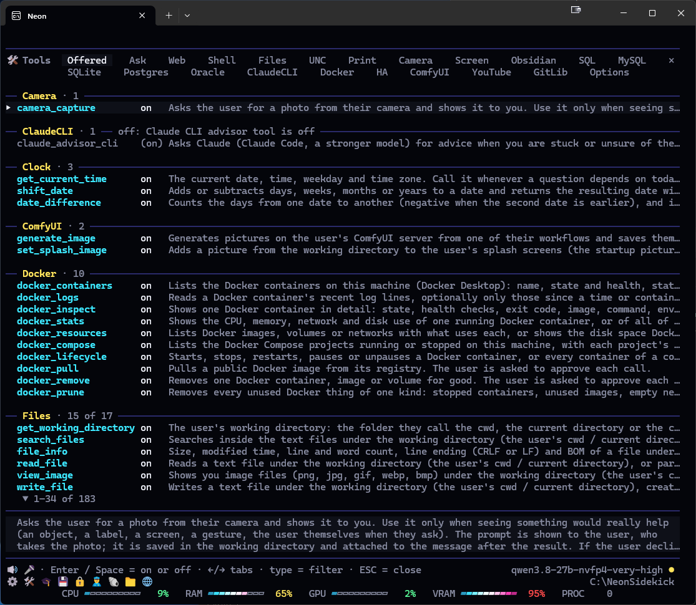

# Neon Sidekick

Neon Sidekick is an agentic terminal client built first and foremost for local LLMs. Point it at LM Studio, Ollama, llama.cpp or vLLM, or let it download a model and run it itself. When you want a frontier model too, it connects to the OpenAI and Anthropic APIs with your own key, or to your Claude Code install.

It's inspired by tools like Claude Code, Hermes Agent and Cline, bringing together the features I liked most in each, plus many they don't have. It's Windows-first, with a preview build for Apple Silicon Macs, built on .NET 10, and meant as a stable base for building and testing new agentic tools.

  
  

  
  

<b><a href="https://github.com/M0j0Risin/NeonSidekick/releases/latest">Download the latest release</a></b> · Windows x64 · macOS on Apple Silicon (preview) · unpack and run

## Contents

- [Features](#features)
- [Getting started](#getting-started)
- [Settings & menus](#settings--menus)
- [About](#about)
- More documentation:
  - [Slash commands](docs/COMMANDS.md)
  - [Tools](docs/TOOLS.md)
  - [Settings reference](docs/SETTINGS.md)
  - [Headless and scripted runs](docs/HEADLESS.md)
  - [Command-line options](docs/COMMANDLINE.md)
  - [Environment variables](docs/ENVIRONMENT.md)
  - [Components & Libraries](docs/COMPONENTS.md)
  - [Building from source](docs/BUILD.md)

## Features

### The app
* **No installer:** unzip and run. NativeAOT compiles it to native code, so it starts fast and needs no .NET runtime.
* **A rich terminal UI:** Markdown, code highlighting, pictures in the transcript, mouse support, and sixty colour themes (or your own).
* **Pictures in:** paste or drag one onto the input line, take one with the webcam (`/camera`), or capture the screen (`/screen`).
* **Windows of its own:** a picture viewer and thumbnail browser (`/view`, `/view --thumbs`), a live camera view (`/camera live`), a log window (`/log`), a background process's output live (`/process <id>`) and the YouTube video window. Each remembers where you left it.
* **Auto-complete** for commands, files, folders, skills and tools.
* **Find in the transcript:** `/find`, folded tool calls and code included.
* **Message queue:** keep typing while the model works; your messages go out in order.
* **Headless mode:** `--headless` runs over stdin/stdout for scripts and scheduled jobs ([HEADLESS.md](docs/HEADLESS.md)).

### Models
* **Local servers:** finds OpenAI-compatible servers on this machine or your network (LM Studio, Ollama, llama.cpp, vLLM…), or takes a URL.
* **Embedded LLM:** No server needed — install Gemma, Qwen or Muse models from `/settings` › Embedded and the app runs them on a built-in llama.cpp, backed by CUDA, Vulkan or CPU (Metal on a Mac). Every model supports vision and tool-calling. Quants run Q4 and up, chosen to fit GPUs with 8–32 GB of VRAM. Several NVFP4 quants are included for Nvidia GPUs.
* **Docker servers (Windows):** your vLLM or SGLang containers as `/server` choices, one running at a time ([vLLM](docs/VLLM_EXAMPLES_WINDOWS.md) and [SGLang](docs/SGLANG_EXAMPLES_WINDOWS.md) examples).
* **Cloud models:** the Anthropic and OpenAI APIs with your own key, or your Claude Code install. All off until you turn them on.
* **Context control:** automatic compaction keeps the conversation inside the model's window; `/compact` and `/rewind` do it by hand.
* **Prompt transparency:** `/sys` shows exactly what the model is sent.

### Profiles, memory & skills
* **Profiles:** each has its own working directory, settings, persona, memory and sessions.
* **Sessions:** resume, search and learn from past conversations.
* **Memory** you can edit, added to every conversation.
* **Skills** at four levels (global, profile, project, or the project's `.agents/skills`), installed from [skills.sh](https://skills.sh) or GitHub with `/skills add`; lock one in `/skills` to keep the model from changing it.
* **Self-learning:** a background reflection writes new skills and improves existing ones from your work.

### Tools & safety
* **Built-in tools:** files, Git, shell (PowerShell, cmd, bash; zsh on a Mac), scripts (PowerShell, Python, Node), web search and browsing, questions on a pane, clock and timers, and `neon_help`, the app's own manual. Every integration below is a set of tools too, offered to the model only when you switch it on in `/tools`. [TOOLS.md](docs/TOOLS.md) lists them all.
* **Sandboxed:** file tools reach only the working directory. Shell commands go through an approval pane (once, this session, or always), and the shell police refuses commands that reach outside it.
* **Plan mode:** `/plan <requirement>` researches with read-only tools and saves a plan; nothing changes until you approve it.
* **MCP servers** for more tools and data sources.

### Voice
* **Voice input:** Whisper speech-to-text in-process, with push-to-talk or a wake word ("hey neon").
* **Speech output:** Kokoro text-to-speech in-process (or a Kokoro server), with voice presets you can mix.

### Integrations
* **Databases:** SQL Server, Oracle, MySQL/MariaDB, PostgreSQL and SQLite over named connections. Read-only by default; writes are opt-in per connection and ask first. Passwords are stored encrypted.
* **Files elsewhere (Windows):** `\\server\share` paths and folders outside the working directory, as you or another Windows account.
* **Obsidian:** search, read, write and link notes in your vault; Obsidian needn't be running.
* **Docker Desktop (Windows):** containers, logs, health and resource use; starting, stopping and cleaning up are opt-in and ask first. `/docker` does the same by hand.
* **Home Assistant:** lights, scenes, the TV, to-do lists and sensors ("dim the den to 30%"). `/ha` drives the house directly.
* **ComfyUI:** pictures from your own workflows (text-to-image, image-to-image, face swaps), or `/imagine` with your own prompt.
* **Picture viewer & editing:** a built-in picture viewer and thumbnail browser, and image editing (resize, crop, rotate, recolour, convert, strip metadata) by the model or a right-click.
* **YouTube:** search (with your API key), then play in the app's own video window, controlled by the model or `/youtube`; saved videos resume where you left off.
* **Printing & PDFs:** `/print` to any installed printer (Windows), and `/pdf` from Markdown, text, pictures or a web page.
* **Claude Code:** `/claude` messages your installed Claude Code; the model can ask it for read-only advice.
* **Bot chat:** `/botchat` lets your profiles talk to each other in their own personas and voices, optionally illustrated by ComfyUI.

### Extras
* `/loop` repeats a message, `/test` benchmarks the connected model, and the performance bar shows CPU, RAM, GPU and network.

## Getting started

### What you need
* **A 64-bit Windows PC** (or an Apple Silicon Mac; see below) with a processor from about 2015 or later (Intel or AMD with AVX2). There's nothing else to install.
* **Windows Terminal** is recommended (it comes with Windows 11); the app is designed for it. On a Mac, Terminal or iTerm2 (iTerm2 shows pictures in full colour).
* **A language model** for it to talk to. The app can download one for you (see below), or use one you already run.

**On a Mac?** A preview build runs on Apple Silicon Macs (M1 and later) in Terminal or iTerm2. Everything above works except printing, `\\server` shares, Docker, `/shortcut` and `/keycheck`. Screen capture, the camera and YouTube playback need macOS 14 or later, and macOS asks your terminal app for the Microphone, Camera or Screen Recording permission the first time. Download it as below, or [build it yourself](docs/BUILD.md#building-on-a-mac).

Only for some features:
* **Running a model inside the app:** an NVIDIA graphics card (driver 580 or newer) or any card that supports Vulkan. Without one it still works, but slowly. On a Mac it runs on the Apple Silicon GPU; a 16 GB Mac suits the smaller Gemma models.
* **Reading web pages that need a real browser, and saving them as PDFs:** Edge, Chrome or Brave.
* **`/claude` and the Claude advisor:** Claude Code installed.
* **Scripts in Python or Node:** Python or Node installed.
* **Better web search:** a SearXNG server ([setup with Docker](docs/SEARXNG_DOCKER_WINDOWS.md)), or an MCP web-search server.

### Install
1. Download `NeonSidekick-v<version>-win-x64.zip` from the [Releases page](https://github.com/M0j0Risin/NeonSidekick/releases).
2. Unzip it into any folder and run `NeonSidekick.exe`. Keep everything in the folder together.

On a Mac (preview):
1. Download `NeonSidekick-v<version>-osx-arm64.tar.gz` from the same page and unpack it (double-click it, or `tar -xzf` in Terminal).
2. The build isn't notarized, so clear macOS's quarantine once: `xattr -dr com.apple.quarantine NeonSidekick-v<version>-osx-arm64`.
3. In Terminal (or iTerm2), go into that folder and run `./NeonSidekick`. Keep everything in the folder together.
4. macOS asks once whether the app may use its Keychain key: choose **Always Allow**. For the Ctrl+Option shortcuts, let Option act as Meta ([how](docs/BUILD.md#building-on-a-mac)).

The `.sha256` file next to each download lets you check the package arrived intact.

### First launch
If no model server answers when the app starts, it opens **Connect a model**:

| Choice | When to pick it |
|---|---|
| Scan for local servers | You already run LM Studio, Ollama, llama.cpp or vLLM on this PC or your network. |
| Enter a server's URL | You know the address of an OpenAI-compatible server. |
| Download an embedded model | You have no server: the app downloads a model and runs it itself. |
| Connect Docker container | You run vLLM or SGLang in Docker Desktop. |
| Use the Anthropic API / Use the OpenAI API | You have an API key (billed per message). |
| Use Claude Code | You have Claude Code installed and a Claude subscription. |

Pick one and the app walks you through it. ESC skips; `/server` brings the page back. Then type a message and press Enter.

Good to know:
* Your settings, memories and conversations are saved in `%USERPROFILE%\.neonsidekick` (`~/.neonsidekick` on a Mac).
* The model can't touch your files, the web or the shell until you allow it in `/tools`.
* Voice is off at first. `/tts` turns on spoken replies and `/stt` voice input; the first time, each downloads what it needs (about 330 MB for speech, about 150 MB for voice input).

### Useful first commands
| Command | What it does |
|---|---|
| `/help` | Lists every command and key. |
| `/settings` | Opens the settings. |
| `/server` | Connects to a model server, or switches to another. |
| `/model` | Picks a model on the current server. |
| `/tools` | Chooses what the model may do: files, web, shell and more. |
| `/cwd` | Changes the folder the model works in. |
| `/tts` / `/stt` | Turns spoken replies / voice input on or off. |

Type `/` in the app to list every command; [COMMANDS.md](docs/COMMANDS.md) has the full reference. To start the app with options (a server, a profile, a script), see [COMMANDLINE.md](docs/COMMANDLINE.md).

## Settings & menus

Everything is set from panes inside the app, and each explains itself: the highlighted row's description and default show under the list. [SETTINGS.md](docs/SETTINGS.md) is the full reference.

| Pane | Opens with | What's in it |
|---|---|---|
| `/settings` | Ctrl+/ or `//` | The app, the LLM server, the embedded model, Docker, Anthropic and OpenAI, voice, sessions and `/botchat`. |
| `/tools` | Ctrl+Alt+T | Which tools the model may use, and each group's options. |
| `/skills` | Ctrl+Alt+S | Agent skills and self-learning. |
| `/mcp` | Ctrl+Alt+D | External MCP servers. |
| `/sys` | Ctrl+Y | What the model is sent. |
| `/usage` | Ctrl+U | Speed and token statistics. |

### Getting around
* **Keyboard:** ←/→ switch tabs, ↑/↓ move, Enter edits or toggles, Space flips an on/off row, ESC closes.
* **Mouse:** a double-click picks a row or tab; the × at the top right closes the pane.
* **Lost?** Ask the model where a setting is. Its `neon_help` tool knows every command and setting.

### The input line
* **Enter** sends. During a reply it queues the message for when the reply ends.
* **ESC** stops a reply. Twice on an empty line it opens `/rewind`.
* **↑/↓** bring back earlier messages.
* **`/`** lists commands, **`@`** files and folders, **`#`** skills and **`$`** tools.
* **Ctrl+O** opens or folds tool calls, code and thinking.

### Handy shortcuts

| Shortcut | Does |
|---|---|
| Ctrl+H | `/help`: every command and key |
| Ctrl+S | `/server`: pick the LLM server |
| Ctrl+M | `/model`: pick the model |
| Ctrl+R | `/reasoning`: how hard the model thinks |
| Ctrl+P | `/profile`: switch profile |
| Ctrl+Z | `/theme`: pick a colour theme |
| Ctrl+Alt+N | `/new`: start a new conversation |

On a Mac, Ctrl+D picks the model (a Mac terminal sends Ctrl+M as Enter). `/help` › Keys lists them all; so does [SETTINGS.md](docs/SETTINGS.md#keyboard-shortcuts).

### Hint row and toolbar
The hint row under the input line shows the model, the context used and anything running in the background; double-click the model name to switch. The toolbar under it has a glyph for each pane and tool group: click one to see what it is, double-click to open it. Ctrl+T hides or shows it.

### Settings worth knowing first

| Setting | Where | What it does | Default |
|---|---|---|---|
| Working directory | `/settings` › General | The folder the file and Git tools work in. | the profile's `files\` |
| LLM URL, LLM model | `/settings` › LLM | The server and model; `/server` and `/model` fill them in. | (none) |
| Theme | `/settings` › General | One of sixty colour themes, or your own. | `collider` |
| Memory mode | `/settings` › General | Whether the model remembers facts about you between sessions. | `read-write` |
| TTS output, STT input | `/settings` › TTS, STT | Reads replies aloud; voice input on a push-to-talk key (F4). | off |
| File tools | `/tools` › Files | Lets the model read and write files in the working directory. | off |
| Web tools | `/tools` › Web | Lets the model search the web and read pages. | off |
| Shell command policy | `/tools` › Shell | Whether the model may run commands: `off`, `ask` (you approve each one) or `yolo` (no asking). | `off` |

A few settings can be overridden for one launch by a [command-line option](docs/COMMANDLINE.md) or an [environment variable](docs/ENVIRONMENT.md).

## About

**Why "Neon":** early on I was trying synthwave-style themes in Spectre.Console while testing the Vosk voice integration. I needed a short, punchy wake word, and "Neon" fit the look. The name stuck.

**What's next:** stronger coding tools, the rest of macOS, and Linux.

**Licence:** GPLv3; see [LICENSE](LICENSE). Built on the libraries in [COMPONENTS.md](docs/COMPONENTS.md).
